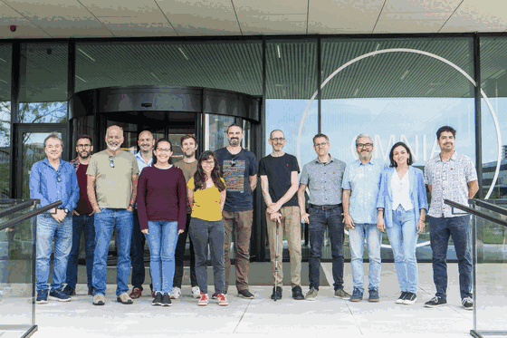
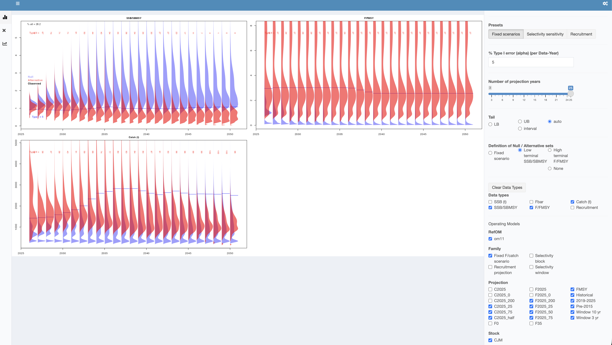

```{r}
date_stamp <- format(Sys.Date(), "%d %B %Y")
```



```{=html}
<div style="font-style: italic; margin-top: 0.5rem;">Jack Mackerel Working Group</div>
```

```{=html}
<div class="paper-title">Report of the Jack Mackerel Management Strategy Evaluation Workshop - SCW17</div>
```

```{=html}
<style>
table:not(.gt_table) th:first-child,
table:not(.gt_table) td:first-child {
  width: 1%;
  min-width: max-content;
  max-width: max-content;
  white-space: nowrap;
}

#day-1-action-items table {
  table-layout: fixed;
  width: 100%;
}

#day-1-action-items table th,
#day-1-action-items table td,
#day-1-action-items table th:first-child,
#day-1-action-items table td:first-child {
  width: 50%;
  min-width: 0;
  max-width: none;
  white-space: normal;
}

#quarto-document-content {
  counter-reset: report-paragraph;
}

#quarto-document-content section > ol {
  list-style: none;
  padding-left: 3rem;
}

#quarto-document-content section > ol > li {
  counter-increment: report-paragraph;
  position: relative;
}

#quarto-document-content section > ol > li::before {
  content: counter(report-paragraph) ".";
  position: absolute;
  left: -3rem;
  width: 2.25rem;
  text-align: right;
}

#quarto-document-content ul {
  list-style: disc;
}

</style>
```

**Meeting:** JMWG Management Strategy Evaluation workshop (SCW17)  
**Dates:** 15-19 June 2026  
**Location:** Wageningen, the Netherlands  
**Organisation:** South Pacific Regional Fisheries Management Organisation  
**Working group:** Jack Mackerel Working Group  
**Host:** EU / PFA  
**Chair:** Jim Ianelli  
**Status:** Draft, Days 1-2  
**Updated:** `r date_stamp`

::: {.callout-note}
## Acknowledgement

The Working Group expresses its gratitude to Niels Hintzen and the Pelagic Freezer Trawler Association (PFA) for sponsoring and supporting the Wageningen workshop.
:::

```{=html}
<p>
  
</p>
```

# Summary {.unnumbered}

1. This report summarizes the current state of the 2026 Jack Mackerel Working Group Management Strategy Evaluation (MSE) workshop report, held in Wageningen, the Netherlands. The workshop continued the MSE programme advanced at SCW15 and focused on preparing operating models (OMs), candidate management procedures (CMPs), performance metrics, robustness scenarios, and supporting documentation for SC14.

1. The group treated model 0.16 as the primary reference for OM conditioning during the workshop, while retaining model 0.00 and the SC13-era configuration as clearly labelled alternatives or robustness tests. The final OM reference set, OM naming conventions, projection-scenario definitions, and communication of alternative model outcomes remain important items for Scientific Committee review.

1. The group agreed to use 0.65 steepness as the base case, move 0.8 steepness to robustness testing, and treat regime/ENSO behaviour as a robustness issue rather than an integral component of the core simulations. Future recruitment and index simulation, including autocorrelation and cross-correlation, were identified as key technical issues because recruitment variability strongly affects projections, reference points, and CMP performance.

1. Reference-point calculation and presentation were a major focus. The group discussed Kobe-plot interpretation, dynamic B~0~, F~35%~ proxies, U/U~MSY~ options, and constant-F yield-curve calculations. A strong recommendation was developed to use within-draw MCMC output to construct dynamic B~MSY~ and use SSB/dynamic B~MSY~ for Kobe-plot and reference-point summaries, so that environmental recruitment variability is better separated from the effects of CMPs on fishing pressure and stock status.

1. CMP discussions emphasized simple, interpretable index-based rules, including piecewise-linear harvest-control rules, TAC-change constraints, smoothing choices, and alternative index combinations. The report records that Members and participants should nominate CMPs for Scientific Committee consideration, after which redundant or materially overlapping CMPs should be eliminated so that review can focus on a concise set of distinct alternatives.

1. Exceptional circumstances were also discussed as a core implementation issue. The group considered the potential use of the ECP software framework to identify data patterns associated with poor CMP performance, compare type I and type II error rates, and support a transparent process for determining whether observations fall outside the range of conditions represented in the MSE.

1. This draft was developed from meeting notes, SCW17 working documents, daily summary material, presentation material, and Day 3 transcript summaries. Artificial-intelligence tools were used to help convert notes into report text; all content should be reviewed by the report authors and meeting participants before submission.

1. In addition to full participation in the workshop, the contractors conducted extensive revisions specific to the jack mackerel MSE work. These included updates to the 2026 operating model input files and control settings, correction of one-stock model configuration issues, recalculation and integration of MSY-based reference points, and refinement of OM conditioning and loading workflows to improve reproducibility and error checking. Substantial work was also completed on candidate index-based management procedures, including combined CPUE indicators, hockeystick and buffer harvest-control rules, tuning diagnostics, and dynamic SB/SB~MSY~ evaluations. Projection tools and reporting scripts were expanded to support fixed-F and fixed-catch scenarios, selectivity sensitivity analyses, two-stock catch allocation checks, and improved visualization of performance trade-offs. Additional diagnostics were developed for survey and CPUE indices, including vulnerable biomass coverage, index correlations, ROC/AUC analyses, and updated reporting outputs to support review by the SPRFMO Jack Mackerel Working Group.

# Introduction {.unnumbered}

1. The Chair opened the workshop and welcomed participants to Wageningen. The local organizer reviewed venue logistics, connectivity, and arrangements for remote participation. Participants, external reviewers, invited experts, and observers introduced themselves.

1. The Chair described the main purpose of the week: to take the assessment work completed at and since the 2026 benchmark and develop operating models suitable for MSE conditioning; to consider CMPs and performance metrics; and to prepare documentation for SC14. The workshop would also revisit technical items carried forward from the benchmark.

1. The Chair reviewed the history of the jack mackerel assessment and MSE programme. Early work included an FAO-supported workshop in Chile and a 2010 workshop in Peru that tested candidate assessment methods against simulated data sets. The Joint Jack Mackerel Model (JJM) subsequently became the agreed assessment platform.

1. The current management advice is based on the management procedure adopted around 2014 and described in Annex K. That procedure links TAC changes to stock status from the assessment and constrains annual TAC changes to provide stability under assessment uncertainty. The Commission and Scientific Committee have since requested a more rigorous, feedback-based MSE with explicit robustness testing.

1. SCW17 builds directly on the SCW15 MSE workshop and the 2026 benchmark. SCW15 developed OM specifications, robustness scenarios, and CMP tuning concepts. The 2026 benchmark reviewed assessment inputs, abundance indices, biological assumptions, and model alternatives. SCW17 is intended to convert that material into a practical MSE design and documentation package for SC14.

1. The Chair reviewed the five-day work plan. The group agreed that work would proceed by consensus. A draft agenda item referring to a Thursday "vote" should be revised to "collaboratively agree", reflecting the intended consensus-based decision process.

1. It was confirmed that the workshop report, the benchmark report, and the post-benchmark model-developments document should be provided to the Scientific Committee so that members and Commissioners can review the methods, alternative model runs, and associated risks.

1. The report follows the main agenda items considered during the week. Agenda item 1 covers developments since the benchmark workshop. Agenda item 2 covers operating-model specifications. Agenda item 3 covers candidate management procedures. Agenda item 4 covers trade-offs, robustness, and performance metrics. Agenda item 5 covers recommendations and next steps.

1. The main objectives for the week were to:

   - Finalize the set of OMs used for MSE conditioning and document the rationale for including or excluding alternatives.
   - Agree how reference points should be calculated and presented for cross-OM comparison and communication.
   - Develop and screen CMPs, including the indices they would use.
   - Define robustness scenarios and the treatment of exceptional circumstances.
   - Record decisions, issues requiring further work, and follow-up tasks for the workshop report to SC14.

# Developments Since the Benchmark

## Assessment, Operating Models, and MSE Approach

1. The group distinguished the annual assessment from the OM used in the MSE. The assessment will continue to support Scientific Committee advice, whereas OM conditioning is a broader exercise intended to represent plausible system dynamics for testing CMPs. Participants cautioned against treating the OM reference set as a single best assessment.

1. The group discussed empirical and assessment-based CMPs. Participants noted that complex assessment-based CMPs can be difficult to simulate faithfully, slow to run, and hard to reproduce if the assessment is repeatedly adjusted. The prevailing view favored simple, locked-in empirical rules tested through MSE, with assessments and legal requirements used as external checks alongside the core automated rule.

1. Exceptional circumstances were introduced as a key design issue. The group noted that a full assessment is one possible response, while indicator-based monitoring could also be used. The Scientific Committee would use the best available information to judge whether exceptional circumstances should be declared, with the detailed response to be developed later in the week.

## Model Developments Since the Benchmark

1. Paper 01 summarized post-benchmark work, including corrections to the Peruvian industrial CPUE series and revised selectivity treatment. A CPUE scaling error was corrected: the effort-creep factor had been applied by multiplication rather than division. Correcting the error lowered the end of the industrial CPUE series, while the artisanal series was unchanged.

1. A reduced-parameter selectivity formulation was presented for the Peruvian fleet. The revised block-based selectivity reduced the number of parameters substantially while producing little change in the length-frequency negative log-likelihood. The group considered the reduced formulation and final-F handling more plausible for OM conditioning.

1. A differentiable penalty was added to discourage mean fishing mortality over ages 2-5 from exceeding high values in implausible solutions. The penalty was described as a regularizing device to help the solver, with converged estimates of biomass and recruitment expected to remain effectively unchanged.

1. The group compared several benchmark-derived model variants, including the SC13-era model 0.00/1.14 and the post-benchmark sequence 0.14, 0.15, and 0.16. Model 0.16 was treated as the primary reference for OM conditioning during the workshop. Model 0.00 was retained as an explicitly flagged alternative and robustness test.

1. Participants noted that the differences among model variants were driven substantially by the revised Peruvian inputs and effort-creep treatment. Critiques of model 0.16 were recorded as concerns about its characteristics, while model 0.00 was treated as an alternative for labelled comparison rather than as a preferred biological interpretation.

1. Diagnostic outputs included one-step-ahead residuals, length-data residuals, retrospective patterns, and MCMC comparisons of posterior and asymptotic estimates. Overall diagnostics were considered adequate for OM conditioning, while retrospective bias, slow-mixing parameters, and dynamic reference-point volatility remained areas for further review.

1. The group reviewed differences between single-stock and two-stock estimates. Splitting the population into two stocks produced a lower combined biomass estimate than the single-stock model. Participants discussed how optimistic and pessimistic indices are redistributed between components and noted that naive merging of components should be avoided.

1. The two-stock configurations showed somewhat different MCMC behaviour but remained usable for comparison. The group noted that structurally divergent OMs are harder to tune jointly and require careful communication if they are included in the reference or robustness set.

# Operating-Model Specifications

## Simulating Indices for Management Procedures

1. The group discussed how to simulate future observations for indices that may track stock biomass differently through time. This is central to the availability and El Nino robustness issues raised at SCW15.

1. Participants agreed that a practical forward-projection representation of standardized indices should use a simpler structure, such as autocorrelation plus observation error, rather than attempting to reproduce the full GLM, GAMM, or spatio-temporal standardization procedures. Routine checks should compare simulated index behaviour with historical variability and observed index-stock correlations.

1. On combining multiple indices in empirical rules, the group agreed that weighting by representativity was more appropriate than weighting by catch.

## Operating-Model Reference Set

1. The composition of the OM reference set was debated, including the implications of model 0.00 as an optimistic high-biomass, low-exploitation outcome that could affect CMP tuning and communication. The practical approach was to focus immediate tuning work on model 0.16, while retaining model 0.00 and the SC13-era configuration as clearly labelled alternatives or robustness tests. The final reference-set decision was identified for further discussion and Scientific Committee review, alongside related work on future recruitment and index simulation, ENSO and broader climate effects, OM-set composition and naming, reference-point proxies, and projection-scenario definitions.

1. The group discussed using cross-correlation among indices to simulate future recruitment deviations. Participants noted that historical correlations are approximate because the series include changes in catchability and selectivity, whereas the projection settings use the more recent period. Residual autocorrelation should also be represented where possible.

1. The group agreed to implement an approximate treatment rather than attempting a fully specified multivariate autocorrelated time-series model. The practical check is whether simulated deviations are consistent with the historical period and suitable for testing CMPs.

## ENSO, Regimes, and Climate Effects

1. The Chair reviewed earlier El Nino work, including catchability drift and the possibility of changing the offshore versus inshore catch distribution in projections. Participants noted that the main practical handle for representing availability effects in the current setup is through recruitment or productivity.

1. The group discussed whether ENSO or regime behaviour should be represented in the core simulations. Earlier ENSO checks provided limited recruitment signal, and each El Nino event may differ in spatial and biological effect. The group agreed to treat regime/ENSO behaviour as a robustness issue, potentially through resampling high- and low-productivity historical periods, rather than as an integral component of the reference simulations.

1. Dr. Tom Carruthers presented options for treating climate effects within MSE, drawing on recent ICCAT climate-test work on robustness trials and climate-robustness performance metrics [Carruthers 2024a, 2024b]. His presentation emphasized that climate effects on single-species dynamics can be reduced to a limited set of impact types: increased natural mortality, reduced somatic growth, reduced condition factor, reduced recruitment strength, spatial redistribution or range contraction, and reduced carrying capacity.

1. The presentation argued that uncertain climate forecasts still allow progress on robust fishery management. Rather than constructing many climate-specific operating models with uncertain credibility, climate robustness can be reported as an attribute of each CMP. Under this framing, CMPs are tested against directional stressors and assigned robustness metrics according to the level of impact they can absorb before breaching a defined threshold. This is consistent with the ICCAT proof-of-concept approach, which shifted the emphasis from defensible forecasts of exact future climate impacts to comparable performance metrics for CMPs.

1. The demonstration used empirical CMPs and climate stress tests for natural mortality, recruitment, growth, and condition factor. It showed how different CMP archetypes can differ in climate robustness, and how the result can be expressed in practical terms for tactical advice. The Working Group expressed its gratitude to Dr. Carruthers for contributing this presentation and for helping frame climate robustness in a form that can support Scientific Committee and Commission discussion.

## Operating-Model Set and Naming

1. The group worked through the OM list and naming conventions. The agreed set included one-stock versus two-stock configurations, model 0.16 versus model 1.14, movement variants, and a selectivity-change variant. The reference set would be conditioned and tuned on the one-stock model, with additional two-stock conditioning; the two-stock 1.14 configuration would serve as a robustness test and must perform acceptably.

1. Movement would be smoothed from 2026 toward the average of the last ten years to avoid an abrupt discontinuity. The selectivity-change robustness test compares a 2005-2015 average with the 2015-2025 recent pattern. Autocorrelation in recruitment deviations provides the current representation of ENSO-related recruitment persistence.

```{r}
#| label: tbl-day2-om-set
#| tbl-cap: "Day 2 operating-model and projection set."
#| echo: false
#| warning: false
#| message: false
#| results: asis

library(gt)

day2_om_set <- data.frame(
  om_case = c("om11", "om21", "om13", "om12", "om22", "om23", "om21_1", "om11_1", "om11_2", "om11_3"),
  proj = c("proj11", "proj21", "proj18", "proj12", "proj22", "proj28", "proj31", "proj11.selex", "proj11.ENSO1", "proj11.ENSO2"),
  om = c("om11", "om21", "om18", "om12", "om22", "om28", "om21", "om11", "om11", "om11"),
  model = c("h1_0.16", "h2_0.16", "h1_1.14", "h1_0.16", "h2_0.16", "h2_1.14", "h2_0.16", "h1_0.16", "h1_0.16", "h1_0.16"),
  SR = c("0.65", "0.65", "0.8", "0.8", "0.8", "0.65", "0.65", "0.65", "0.65, residual failure", "0.65, residual 7-year El Nino cycle"),
  mvt = c("NA", "0", "NA", "NA", "0", "0", "1", "NA", "NA", "NA"),
  selex = c("2015-2025", "2015-2025", "2015-2025", "2015-2025", "2015-2025", "2015-2025", "2015-2025", "2005-2015", "2015-2025", "2015-2025"),
  set = c("ref", "rob tuning", "rob", "rob", "rob", "rob", "rob", "rob", "rob", "rob")
)

day2_om_set |>
  gt() |>
  cols_label(
    om_case = "om",
    proj = "proj",
    om = "om",
    model = "model",
    SR = "SR",
    mvt = "mvt",
    selex = "selex",
    set = "set"
  ) |>
  cols_width(
    om_case ~ px(78),
    proj ~ px(118),
    om ~ px(78),
    model ~ px(92),
    SR ~ px(210),
    mvt ~ px(60),
    selex ~ px(96),
    set ~ px(92)
  ) |>
  tab_options(
    table.font.size = px(13),
    table.width = pct(100),
    data_row.padding = px(3),
    column_labels.padding = px(4)
  )
```

# Management Procedures

1. Recruitment-deviation scenarios were discussed in detail. The group considered low-recruitment, recruitment-failure, and cyclical recruitment patterns, including whether recovery should be abrupt or gradual. There was concern that some future recruitment simulations may generate biomass variability that is broader than expected from the historical record, even under F = 0 projections. The group noted the need to compare historical and projected recruitment and biomass patterns to ensure the projection behavior is realistic and not overly precautionary because of excessive simulated environmental variability.

1. Projection evaluations from Paper 07 were used to examine constant-catch and constant-F scenarios, including no fishing, F~MSY~, current F, and reduced-F or reduced-catch cases. These diagnostics were used to understand trade-offs among spawning biomass, fishing mortality, catch, and terminal status. The group noted that F~MSY~ and B~MSY~ calculations, selectivity averaging windows, and recruitment assumptions can materially affect interpretation, so those methods should be checked and documented.

1. CMP and HCR discussions emphasized starting with simple, interpretable rules. The group discussed index-based rules in which catch responds to changes in one or more abundance indices, rather than relying on constant catch. Several design handles were identified for testing: whether the rule passes through the origin, whether it includes a minimum catch or flat low-index segment, upper catch limits, trigger points, smoothing windows, polynomial smoothing, and TAC-change constraints. The group specifically discussed testing constraints such as 20% increases and 15% decreases, and evaluating whether these constraints still allow the CMP to respond quickly enough to low-recruitment events.

1. There was also discussion of which indices should feed CMPs. The initial rules used a small set of indices, but participants discussed adding or comparing additional indices, including acoustic and CPUE-related indices. The group noted that combined or weighted indices may simplify implementation, but the choice should reflect the simulated observation process and the relative reliability of each index.

1. Tuning and performance summaries were discussed as a practical next step. The group planned to run grids of HCR/CMP configurations and summarize results using compact performance tables and diagnostic plots showing biomass, yield, and yield variability. The aim was to identify broad trade-off behavior rather than over-interpret early individual runs.

1. A substantial part of the Day 3 discussion addressed exceptional circumstances protocols. Tom Carruthers demonstrated the ECP approach, emphasizing that exceptional circumstances should not be based only on whether an observation falls outside a projected range. Instead, robustness simulations can be used to identify data patterns associated with poor CMP performance, and then evaluate type I and type II error rates for detecting those problematic states. The group discussed applying this framework to jack mackerel MSE outputs, including recent concerns about fishing conditions, recruitment, stock indicators, and the possibility that current observations may imply conditions outside the reference simulations.

1. A further point was that fishery behavior and effort constraints may matter. Participants noted that a TAC may be theoretically catchable in the model but not economically or operationally achievable if vessels cannot find fish or if fishing conditions deteriorate. There was interest in whether effort or fleet-behavior constraints could be represented in future scenarios or diagnostics, while recognizing that doing so would require additional assumptions and data.

1. CMPs based on piecewise-linear harvest-control rules can be summarized by the threshold metric at which the rule begins to increase catch, the target catch reached above the trigger, and any inter-annual TAC-change constraints. Part of the SCW17 process is for Members and participants to nominate CMPs for Scientific Committee consideration, after which redundant or materially overlapping CMPs should be eliminated so that the Scientific Committee can focus on a concise set of distinct alternatives. @tbl-hcr-candidates records the parameters used for the illustrative CMP set. @fig-hcr-faceted shows the static HCR shape for each row; smoothing choices and index selection affect the metric passed into the HCR and are omitted from the curve. The quadrant colors in @fig-hcr-faceted are included only to enhance visualization of differences among HCR shapes and do not indicate stock-status concerns.

```{r}
#| label: setup-hcr-candidates
#| include: false

library(gt)
library(ggplot2)
library(ggthemes)
library(dplyr)
library(tidyr)
library(tibble)

mp_table <- tribble(
  ~mp_name, ~min, ~lim, ~trigger, ~target, ~dlow, ~dupp, ~smooth, ~indices,
  "Base (Wed pm)",             0,   0.5, 1.5, 1385,   Inf,  Inf, "4 years",          "C_CPUE, offshore",
  "Zero-Zero",                 0,   0,   1.5, 1385,   Inf,  Inf, "4 years",          "C_CPUE, offshore",
  "15% Constraint",            0,   0,   1.5, 1385,   0.85, 1.2, "4 years",          "C_CPUE, offshore",
  "20% Constraint",            0,   0,   1.5, 1385,   0.80, 1.2, "4 years",          "C_CPUE, offshore",
  "50% Inc",                   0,   0,   2.25,2077.5, Inf,  Inf, "4 years",          "C_CPUE, offshore",
  "15% Constraint 50% Inc",    0,   0,   2.25,2077.5, 0.85, 1.2, "4 years",          "C_CPUE, offshore",
  "3-Year mean 50% Inc",       0,   0,   2.25,2077.5, 0.85, 1.2, "3 years",          "C_CPUE, offshore",
  "Polynomial10",              0,   0,   2.25,2077.5, 0.85, 1.2, "poly (enp = 0.1)", "C_CPUE, offshore",
  "Polynomial20",              0,   0,   2.25,2077.5, 0.85, 1.2, "poly (enp = 0.2)", "C_CPUE, offshore",
  "Polynomial30",              0,   0,   2.25,2077.5, 0.85, 1.2, "poly (enp = 0.3)", "C_CPUE, offshore",
  "100% Inc",                  0,   0,   3,   2770,   0.85, 1.2, "4 years",          "C_CPUE, offshore",
  "minC",                    270,   0.2, 1.5, 1385,   0.85, 1.2, "4 years",          "C_CPUE, offshore",
  "minC",                    270,   0.2, 1.5, 1500,   0.85, 1.2, "4 years",          "C_CPUE, offshore",
  "All_indices",               0,   0,   1.5, 1385,   0.85, 1.2, "4 years",          "C_CPUE, offshore, Acoustic_N, Peru_Art",
  "N_indices",                 0,   0,   1.5, 1385,   0.85, 1.2, "4 years",          "Acoustic_N, Peru_Art"
) |>
  mutate(
    mp_facet = if_else(
      duplicated(mp_name) | duplicated(mp_name, fromLast = TRUE),
      paste0(mp_name, " target=", target),
      mp_name
    ),
    output = "catch"
  )
```

```{r}
#| label: tbl-hcr-candidates
#| tbl-cap: "Draft piecewise-linear CMP parameters used for the illustrative HCR figure."
#| echo: false
#| message: false
#| warning: false
#| results: asis

mp_table |>
  select(mp_name, min, lim, trigger, target, dlow, dupp, smooth, indices, output) |>
  mutate(
    dlow = if_else(is.infinite(dlow), "unconstrained", as.character(dlow)),
    dupp = if_else(is.infinite(dupp), "unconstrained", as.character(dupp))
  ) |>
  gt() |>
  cols_label(
    mp_name = "CMP name",
    min = "min",
    lim = "lim",
    trigger = "trigger",
    target = "target",
    dlow = "dlow",
    dupp = "dupp",
    smooth = "smooth",
    indices = "indices",
    output = "output"
  ) |>
  cols_width(
    mp_name ~ px(145),
    min ~ px(56),
    lim ~ px(56),
    trigger ~ px(70),
    target ~ px(76),
    dlow ~ px(104),
    dupp ~ px(104),
    smooth ~ px(110),
    indices ~ px(220),
    output ~ px(70)
  ) |>
  tab_options(
    table.font.size = px(12),
    table.width = pct(100),
    data_row.padding = px(3),
    column_labels.padding = px(4)
  )
```

```{r}
#| label: fig-hcr-faceted
#| fig-cap: 'Draft CMP piecewise-linear harvest-control-rule shapes. Output = "catch"; dashed vertical lines show trigger values, dotted vertical lines show limits, and horizontal lines show minimum and target catch. Quadrant colors are used only to enhance visualization of HCR-shape differences and do not indicate stock-status concerns.'
#| echo: false
#| message: false
#| warning: false
#| fig-width: 10
#| fig-height: 8

hcr_xmax <- max(mp_table$trigger, mp_table$lim) * 1.35
hcr_ymax <- max(mp_table$target) * 1.15

hcr_curve <- mp_table |>
  rowwise() |>
  mutate(metric = list(seq(0, hcr_xmax, length.out = 250))) |>
  unnest(metric) |>
  ungroup() |>
  mutate(
    catch = case_when(
      metric <= lim ~ min,
      metric < trigger ~ (metric - lim) * ((target - min) / (trigger - lim)) + min,
      TRUE ~ target
    ),
    above_region = if_else(metric < trigger, "Above HCR, below trigger", "Above HCR, above trigger"),
    below_region = if_else(metric < trigger, "Below HCR, below trigger", "Below HCR, above trigger")
  )

ggplot(hcr_curve, aes(metric, catch)) +
  geom_ribbon(
    aes(
      ymin = catch,
      ymax = hcr_ymax,
      fill = above_region,
      group = interaction(mp_facet, above_region)
    ),
    alpha = 0.42,
    colour = NA
  ) +
  geom_ribbon(
    aes(
      ymin = 0,
      ymax = catch,
      fill = below_region,
      group = interaction(mp_facet, below_region)
    ),
    alpha = 0.42,
    colour = NA
  ) +
  geom_line(linewidth = 0.9, colour = "#1f78b4") +
  geom_vline(aes(xintercept = lim), linetype = 3, linewidth = 0.35) +
  geom_vline(aes(xintercept = trigger), linetype = 2, linewidth = 0.35) +
  geom_hline(aes(yintercept = target), linetype = 2, linewidth = 0.35) +
  geom_hline(aes(yintercept = min), linetype = 3, linewidth = 0.35) +
  facet_wrap(~ mp_facet, ncol = 3) +
  scale_fill_manual(
    values = c(
      "Above HCR, below trigger" = "#f4a7a3",
      "Below HCR, below trigger" = "#f6c26b",
      "Below HCR, above trigger" = "#a9d99b",
      "Above HCR, above trigger" = "#f4df78"
    ),
    guide = "none"
  ) +
  coord_cartesian(xlim = c(0, hcr_xmax), ylim = c(0, hcr_ymax), expand = FALSE) +
  labs(
    x = "HCR metric",
    y = "Catch"
  ) +
  ggthemes::theme_few() +
  theme(
    strip.text = element_text(face = "bold", size = 8),
    panel.grid.minor = element_blank()
  )
```

# Trade-offs, Robustness, and Performance Metrics

## Reference Points and Kobe-Plot Summaries

1. Paper 02 presented alternative reference-point calculations, including dynamic B~0~ and F~35%~ as a practical proxy for F~MSY~. The averaging window for selectivity used in reference-point calculations affects the results and should be documented.

1. The group discussed the Kobe plot and noted that much of the apparent movement in the plot reflects changes in the reference points rather than changes in the underlying trajectory. F~MSY~ is highly sensitive to steepness because the yield curve is shallow, while B~MSY~ appears more stable. The recruitment diagnostics in [Figure 3 of SCW17/Paper-07](https://sprfmo.github.io/scw17/SCW17-Paper-07-Projection-evaluations.html#fig-recruitment) show historical and future recruitment for the selected operating model; the future portion uses the F = 0 projection, and colored lines show 15 sampled MCMC draws.

1. Proxy reference-point options were discussed to avoid relying directly on a poorly defined F~MSY~. Options included 35% of dynamic B~0~ with F~35%~, a U/U~MSY~ proxy based on catch over vulnerable biomass, and a constant-F projection approach to deriving F~MSY~ from a yield curve. Reference points would be recomputed within projections, with a configurable averaging window.

1. The group agreed to retain Kobe plots as the primary stakeholder communication tool and to add an F~35~-based figure to test consistency across OMs. Participants noted that apical-F metrics can be unstable when driven by highly selected older ages that are rare in the population, and that a vulnerability-weighted exploitation metric may be more stable.

1. The group noted that the probability target for being in the green zone depends on the reference-point calculation method. Methodological choices, including steepness and reference-point definitions, may shift outcomes more than the difference between candidate probability targets.

1. The group gave extensive consideration to how environmental effects on recruitment should be reflected in reference-point calculations and Kobe-plot summaries. Recruitment shows a relatively high degree of autocorrelation, which produces substantial environmental variability in both historical patterns and projections. To better separate the effect of a CMP on human activities and fishing pressure from underlying environmental variability, the group considered a dynamic reference-point approach based on within-draw MCMC output. Under this approach, the MSY spawning-biomass level is first calculated within each draw as B~MSY~/B~0~. That ratio is then multiplied by the corresponding dynamic B~0~ to create a dynamic B~MSY~ that accounts for environmental variability. The trace used for Kobe-plot and reference-point considerations is then spawning biomass divided by this dynamic B~MSY~.

1. **Recommendation:** The Working Group strongly recommends using the range of within-draw MCMC output to compute B~MSY~/B~0~, construct a dynamic B~MSY~ by multiplying that ratio by dynamic B~0~, and use SSB/dynamic B~MSY~ as the Kobe-plot and reference-point trace. This approach better reflects autocorrelated environmental recruitment variability while focusing CMP evaluation on the management effect on fishing and stock status.

## Tuning and Robustness

1. The Chair advised against tuning CMPs to individual OMs, because that would imply knowledge of which OM is true. The standard practice is to tune across a reference grid of OMs, producing CMPs with performance that reflects the range of plausible productivity and observation assumptions.

1. Joint tuning across structurally divergent OMs, such as one-stock and two-stock models, increases computational and communication challenges. Weighting schemes for combining OMs remain a substantive design choice and should be documented if used.

1. The group agreed to use 0.65 steepness as the base case and move 0.8 steepness to robustness testing. Iago Mosqueira also presented recruitment-deviation scenarios to be run with the one-stock reference OM; detailed specifications should be checked against the working documents.

## Consideration of Exceptional Circumstances

1. Dr. Tom Carruthers gave a presentation on exceptional-circumstances protocols and the ECP software application, which provides a Shiny interface for examining whether new observations remain consistent with the conditions under which an adopted management procedure was tested [Blue Matter Science 2026]. The group discussed this issue in the jack mackerel MSE context, recognizing that initial exceptional circumstances may need to be considered given current fishing conditions and other stock-condition indicators being substantially below previous assessments.

1. **Recommendation:** The Working Group recommends investigating the potential use of the ECP software for this MSE application. As a proof of concept, the chair demonstrated that current MSE output could be slotted readily into the type of input structure used by the ECP software.

@fig-ecp-preliminary shows a partial screenshot from this preliminary application of the ECP software to the jack mackerel MSE outputs.

{#fig-ecp-preliminary fig-alt="Screenshot of an ECP application interface showing violin-style diagnostic plots for SSB over BMSY, F over FMSY, catch, and a settings panel for SPRFMO jack mackerel MSE outputs."}

# Planning for SC14 and Next Steps

::: {.callout-note title="Preliminary note"}
The following planning notes are preliminary and will likely be deleted or stated elsewhere in the final workshop report.

1. The Day 2 discussions produced several practical directions for the next round of work. Future recruitment deviations should be simulated with an approximate cross-correlation and autocorrelation treatment, followed by comparison with the historical period. ENSO and regime behaviour should be treated as robustness tests rather than integral core-simulation components, although the timing of that work remains to be confirmed. Climate treatment should be framed through robustness or stress testing and presented clearly to the Scientific Committee. The OM set should retain the one- versus two-stock contrast, model 0.16 versus 1.14, movement variants, and a selectivity-change variant, with the 2026 movement transition smoothed to the 10-year average. Reference-point work should continue to focus on proxies for poorly defined F~MSY~, including 35% dynamic B~0~ with F~35%~, U/U~MSY~, and/or constant-F yield-curve calculations.

1. Follow-up actions from Day 1 included:

- The assessment team will provide model 0.16 diagnostics for comparison with other variants, reintroduce explicit effort constraints to limit implausible inter-annual effort spikes for Peru artisanal fisheries, display the previously submitted document on the Peru two-regime hypothesis, and add an F~35%-based comparison figure with documented selectivity assumptions and averaging windows.
- I. Paya will confirm whether model 0.00 matches the previous year's spawning-biomass estimates.
- The Working Group will decide whether to freeze current data inputs and proceed with OM conditioning, and compare model configurations to assess robustness and the effect of Peruvian CPUE changes.
- Analysts will focus immediate CMP tuning work on model 0.16 and present model 0.00 as a labelled alternative.
- Workshop organizers will prepare final Paper 01 and the workshop report for Scientific Committee submission.

1. Follow-up actions from Day 2 included:

- I. Mosqueira and team will implement approximate recruitment-deviation simulation with autocorrelation, compare simulations against the historical period, finalize and distribute the agreed OM set and naming conventions, and run the recruitment-deviation scenarios with the reference OM.
- The assessment team will clarify and fix the anomalous F forecast identified in the OM set.
- The Working Group will resolve how the northern stock can be handled by defining an appropriate F~MSY~ treatment inside the CMP.
- J. Ianelli and T. Carruthers will prepare a Scientific Committee presentation on climate treatment in the MSE.
- J. Ianelli and the assessment team will produce proxy-based Kobe plots and constant-F yield-curve reference-point calculations.

1. Issues identified for further work during the remainder of SCW17 included the final composition and weighting of the OM reference set; the relative influence of Peruvian CPUE changes, effort-creep treatment, and alternative biological interpretations on model 0.16; how to simulate standardized CPUE and other indices in forward projections; whether structurally divergent OMs should be tuned jointly or treated separately; instability in dynamic reference points and apical-F metrics; the choice of running-average window for reference-point calculations; the effect of including optimistic alternatives on probability-of-green-zone tuning and Commission communication; the operational definition and response process for exceptional circumstances; the approximate nature of autocorrelated, multivariate recruitment simulation; the Scientific Committee framing of climate effects; the anomalous F forecast; the northern-stock F~MSY~ definition inside the CMP; and the total OM count and associated computational load.
:::

# References {.unnumbered}

- SPRFMO. 2025. Report of the Management Strategy Evaluation Workshop (SCW15), 14-18 July 2025. <https://sprfmo.github.io/SCW15_report/>
- SPRFMO. 2026. JMWG Benchmark Meeting Report 2026, 18-22 May 2026, Lima. <https://sprfmo.github.io/JM_SCW_prep/JMWG-Benchmark-Meeting-report-2026.html>
- SPRFMO. 2026. SCW17 working documents. <https://sprfmo.github.io/scw17/>
- Carruthers, T. R. 2024a. Developing the Climate Test: Robustness Trials for Climate-Ready Management Procedures. SCRS/2024/104. Collect. Vol. Sci. Pap. ICCAT, 81(6): 1-26. <https://www.iccat.int/Documents/CVSP/CV081_2024/n_6/CV08106104.pdf>
- Carruthers, T. R. 2024b. Developing the Climate Test: Performance Metrics of Climate Robustness. SCRS/2024/148. Collect. Vol. Sci. Pap. ICCAT, 81(2): 1-7. <https://www.iccat.int/Documents/CVSP/CV081_2024/n_2/CV08102148.pdf>
- Carruthers, T. 2026. Developing the Climate Test: Climate Robustness as an Attribute of Management Procedures. Presentation to the SPRFMO Jack Mackerel MSE Workshop, 15 June 2026.
- Blue Matter Science. 2026. ECP: Exceptional Circumstances Protocols for Adopted Management Procedures. R Shiny application. <https://shiny.bluematterscience.com/>
- Annex K. Original jack mackerel management procedure.

# Appendix A. Participants {.unnumbered}

::: {.callout-warning}
## Verification needed

Names and affiliations below are reconstructed from the Day 1 summary and should be confirmed before submission.
:::

| Name | Affiliation / delegation | Role |
|---|---|---|
| Jim Ianelli | NOAA Fisheries (USA) | Chair / coordinator |
| Niels Hintzen | PFA (EU delegation) | Local organizer / rapporteur |
| Karolina Molla Gazi | European Union delegation | Member |
| Iago Mosqueira | MSE analyst (FLR / openMSE) | Analyst |
| Benoit Berges | Wageningen Marine Research | Member |
| Ignacio Paya | IFOP (Chile) | Member |
| Jose Zenteno | IFOP (Chile) | Member |
| Aquiles Sepulveda | INPESCA (Chile) | Member |
| Nicole Mermoud | Subsecretaria de Pesca y Acuicultura (Chile) | Head of delegation |
| Criscely Lujan | IMARPE (Peru) | Member |
| Miriam Geronimo | IMARPE (Peru) | Member |
| David Miller | ICES Secretariat | External reviewer |
| Rosana Ourens | CEFAS (UK) | External reviewer |
| Tom Carruthers | Blue Matter Science | Invited expert |
| Ash Wilson | Pew Charitable Trusts | Observer |

# Appendix B. Workshop Schedule and Agenda {.unnumbered}

The workshop agenda was organized around the main report sections:

::: {.agenda-list}
1. Developments since the benchmark.
2. Operating-model specifications.
3. Candidate management procedures.
4. Trade-offs, robustness, and performance metrics.
5. Planning for SC14 and next steps.
:::

| Day | Theme | Hours |
|---|---|---|
| Monday 15 June | Opening and benchmark handoff | 09:00-18:00 |
| Tuesday 16 June | Operating-model specifications | 08:30-17:00 |
| Wednesday 17 June | Candidate management procedures | 09:00-18:00 |
| Thursday 18 June | Trade-offs, robustness, and shortlist decision | 09:00-18:00 |
| Friday 19 June | Recommendations and close | 09:00-12:00 |

# Appendix C. SCW17 Working Documents {.unnumbered}

| Document | Title |
|---|---|
| [Paper 00](Wageningen-MSE-workshop-schedule.html) | Agenda and schedule |
| [Paper 01](SCW17-Paper-01-ModelDevelopments.html) | Model developments |
| [Paper 01a](SCW17-Paper-01a-Far-North-Model-Selectivity.html) | Far North model selectivity |
| [Paper 02](SCW17-Paper-02-ReferencePoints.html) | Consideration of reference points used for SPRFMO jack mackerel management |
| [Paper 03](SCW17-Paper-03-Management-Procedures-Inventory.html) | Management-procedures inventory for the jack mackerel MSE |
| [Paper 04](SCW17-Paper-04-MSE-Flow.html) | MSE flow |
| [Paper 05](SCW17-Paper-05-Chile-HCR-Proposals.html) | Chile harvest-control-rule proposals |
| [Paper 06](SCW17-Paper-06-Evaluation-of-indices-for-MP-considerations.html) | Evaluation of indices for CMP considerations |
| [Paper 07](SCW17-Paper-07-Projection-evaluations.html) | Projection evaluations |

*Draft working report - Day 1 of the SCW17 MSE workshop, 15 June 2026. Prepared for review and correction by participants before submission to the SPRFMO Scientific Committee.*
