

```{=html}
<div class="paper-title">SCW17/Paper-01: Model developments</div>
```

```{r}
#| label: setup
#| include: false

library(jjmR)
library(tidyverse)
library(kableExtra)
library(knitr)

date_stamp <- format(Sys.Date(), "%d %B %Y")
doc_dir <- normalizePath(dirname(knitr::current_input(dir = TRUE)), winslash = "/", mustWork = TRUE)
assessment_candidates <- c(
  Sys.getenv("JJM_ASSESSMENT_DIR", unset = ""),
  file.path(doc_dir, "..", "assessment"),
  file.path(doc_dir, "..", "..", "jjm", "assessment")
)
assessment_candidates <- assessment_candidates[nzchar(assessment_candidates)]
assessment_dir <- assessment_candidates[file.exists(file.path(assessment_candidates, "config"))][1]
if (is.na(assessment_dir)) {
  stop("Could not find the JJM assessment directory. Set JJM_ASSESSMENT_DIR to its path.")
}
assessment_dir <- normalizePath(assessment_dir, winslash = "/", mustWork = TRUE)
assessment_file <- function(...) file.path(assessment_dir, ...)
knitr::opts_knit$set(root.dir = assessment_dir)
theme_set(theme_jjm(base_size = 14))

core_versions <- c("0.00", "0.14", "0.15", "0.16")
srr_versions <- c("0.16hs", "0.16ls", "0.16ll", "0.16hl")
versions <- c(core_versions, srr_versions)
hypotheses <- c("h1", "h2")
core_model_ids <- as.vector(outer(hypotheses, core_versions, paste, sep = "_"))
srr_model_ids <- as.vector(outer(hypotheses, srr_versions, paste, sep = "_"))
model_ids <- c(core_model_ids, srr_model_ids)

model_descriptions <- tribble(
  ~model, ~model_label, ~role, ~description,
  "0.00", "0.00", "SCW16 baseline", "SCW16 baseline configuration retained to anchor the model-development bridge.",
  "0.14", "0.14", "SCW16 final bridge", "SCW16 proposed final configuration used as the main comparison point for subsequent development.",
  "0.15", "0.15", "Model development", "Uses the 0.15 data treatment, including separate nominal Peruvian artisanal and industrial CPUE indices. The Peruvian CPUE q random walks are removed.",
  "0.16", "0.16", "Productivity-regime development", "Same data treatment as 0.15. For h2, the change is in productivity-regime specifications: stock 2 is represented with one productivity regime rather than separate pre/post regimes. The h1_0.15.ctl and h1_0.16.ctl files have the same biological and data specifications.",
  "0.16hs", "0.16 HS", "Productivity exercise", "High steepness with short stock-recruitment years.",
  "0.16ls", "0.16 LS", "Productivity exercise", "Low steepness with short stock-recruitment years.",
  "0.16ll", "0.16 LL", "Productivity exercise", "Low steepness with long stock-recruitment years.",
  "0.16hl", "0.16 HL", "Productivity exercise", "High steepness with long stock-recruitment years."
)

display_model <- function(x) {
  labels <- setNames(model_descriptions$model_label, model_descriptions$model)
  out <- unname(labels[x])
  ifelse(is.na(out), x, out)
}

model_labels <- setNames(
  rep(model_descriptions$model_label, each = length(hypotheses)),
  as.vector(outer(hypotheses, model_descriptions$model, paste, sep = "_"))
)

strip_inline_comment <- function(x) {
  trimws(sub("\\s+#.*$", "", x))
}

after_tag <- function(lines, tag) {
  hit <- which(trimws(lines) == tag)
  if (!length(hit) || hit[1] == length(lines)) {
    return(NA_character_)
  }
  strip_inline_comment(lines[hit[1] + 1])
}

read_ctl_summary <- function(model_id) {
  ctl_path <- assessment_file("config", paste0(model_id, ".ctl"))
  if (!file.exists(ctl_path)) {
    return(tibble(
      model_id = model_id,
      control_file = basename(ctl_path),
      data_file = NA_character_,
      model_name = NA_character_,
      nstocks = NA_character_,
      nregby_stock = NA_character_,
      rec_matrix = NA_character_,
      nyrs_sr = NA_character_,
      n_q = NA_integer_,
      projection_years = NA_character_,
      control_exists = FALSE
    ))
  }

  lines <- readLines(ctl_path, warn = FALSE)
  q_vals <- suppressWarnings(scan(text = after_tag(lines, "#qMatrix"), quiet = TRUE))
  tibble(
    model_id = model_id,
    control_file = basename(ctl_path),
    data_file = after_tag(lines, "#dataFile"),
    model_name = after_tag(lines, "#modelName"),
    nstocks = after_tag(lines, "#nStocks"),
    nregby_stock = after_tag(lines, "#nregbyStock"),
    rec_matrix = after_tag(lines, "#RecMatrix"),
    nyrs_sr = after_tag(lines, "#Nyrs_sr"),
    n_q = length(q_vals),
    projection_years = after_tag(lines, "#n_proj_yrs"),
    control_exists = TRUE
  )
}

result_status <- function(model_id) {
  tibble(
    model_id = model_id,
    has_par = file.exists(assessment_file("results", paste0(model_id, ".par"))),
    has_rep = file.exists(assessment_file("results", paste0(model_id, ".rep"))),
    has_std = file.exists(assessment_file("results", paste0(model_id, ".std"))),
    has_yld = file.exists(assessment_file("results", paste0(model_id, ".yld"))),
    has_r_report = file.exists(assessment_file("results", paste0(model_id, "_1_R.rep"))),
    completed_output = has_par & has_rep
  )
}

control_inventory <- map_dfr(model_ids, read_ctl_summary) |>
  left_join(map_dfr(model_ids, result_status), by = "model_id") |>
  mutate(
    hypothesis = str_remove(model_id, "_.*$"),
    model = str_remove(model_id, "^h[12]_"),
    model_label = display_model(model),
    .before = 1
  )

completed_versions <- versions[
  map_lgl(versions, ~ all(control_inventory$completed_output[control_inventory$model == .x]))
]
core_completed_versions <- intersect(core_versions, completed_versions)
srr_completed_versions <- intersect(srr_versions, completed_versions)
bridge_versions <- intersect(c("0.00", "0.14"), completed_versions)

read_model_output <- function(model_id) {
  old_wd <- getwd()
  on.exit(setwd(old_wd), add = TRUE)
  setwd(assessment_dir)
  tryCatch(
    readJJM(model_id, path = "config", input = "input"),
    error = function(e) NULL
  )
}

model_cache <- new.env(parent = emptyenv())

read_model <- function(model_id) {
  if (!exists(model_id, envir = model_cache, inherits = FALSE)) {
    assign(model_id, read_model_output(model_id), envir = model_cache)
  }
  mod <- get(model_id, envir = model_cache, inherits = FALSE)
  if (is.null(mod) || is.null(mod[[model_id]])) {
    return(NULL)
  }
  mod[[model_id]]
}

model_readable <- function(model_id) {
  !is.null(read_model(model_id))
}

par_summary <- function(model_id) {
  par_file <- assessment_file("results", paste0(model_id, ".par"))
  if (!file.exists(par_file)) {
    return(tibble(
      model_id = model_id,
      hypothesis = str_remove(model_id, "_.*$"),
      model = str_remove(model_id, "^h[12]_"),
      nopar = NA_integer_,
      nll = NA_real_,
      max_gradient = NA_real_
    ))
  }
  vals <- suppressWarnings(as.numeric(scan(par_file, what = "", n = 16, quiet = TRUE)[c(6, 11, 16)]))
  tibble(
    model_id = model_id,
    hypothesis = str_remove(model_id, "_.*$"),
    model = str_remove(model_id, "^h[12]_"),
    nopar = as.integer(vals[1]),
    nll = vals[2],
    max_gradient = vals[3]
  )
}

value_at_year <- function(x, year) {
  if (is.matrix(x) || is.data.frame(x)) {
    x <- as.matrix(x)
    val <- as.numeric(x[x[, 1] == year, 2])
    if (length(val) == 0) return(NA_real_)
    return(val)
  }
  NA_real_
}

terminal_model_metrics <- function(model_id) {
  mod <- read_model(model_id)
  if (is.null(mod)) {
    return(tibble())
  }
  endyr <- mod$data$years[1, 2]

  map_dfr(names(mod$output), function(stock) {
    out <- mod$output[[stock]]
    terminal_row <- endyr - mod$data$years[1, 1] + 1
    tibble(
      model_id = model_id,
      hypothesis = str_remove(model_id, "_.*$"),
      model = str_remove(model_id, "^h[12]_"),
      model_label = display_model(str_remove(model_id, "^h[12]_")),
      stock = stock,
      year = endyr,
      ssb = value_at_year(out$SSB, endyr),
      total_biomass = value_at_year(out$TotBiom, endyr),
      recruitment = value_at_year(out$R, endyr),
      max_total_f_at_age = max(as.numeric(out$TotF[terminal_row, ]), na.rm = TRUE)
    )
  })
}

comparison_delta <- function(metrics, base_model = "0.14") {
  if (!nrow(metrics) || !base_model %in% metrics$model) {
    return(tibble())
  }
  metrics |>
    select(model, model_label, hypothesis, stock, year, ssb, total_biomass, recruitment, max_total_f_at_age) |>
    left_join(
      metrics |>
        filter(model == base_model) |>
        select(
          hypothesis,
          stock,
          ssb_base = ssb,
          total_biomass_base = total_biomass,
          recruitment_base = recruitment,
          max_total_f_at_age_base = max_total_f_at_age
        ),
      by = c("hypothesis", "stock")
    ) |>
    mutate(
      ssb_delta_pct = 100 * (ssb / ssb_base - 1),
      total_biomass_delta_pct = 100 * (total_biomass / total_biomass_base - 1),
      recruitment_delta_pct = 100 * (recruitment / recruitment_base - 1),
      max_total_f_at_age_delta_pct = 100 * (max_total_f_at_age / max_total_f_at_age_base - 1)
    )
}

relabel_models <- function(mods, labels) {
  current_names <- names(mods)
  new_names <- unname(labels[current_names])
  names(mods) <- ifelse(is.na(new_names), current_names, new_names)
  mods
}

safe_compare_models <- function(model_names) {
  old_wd <- getwd()
  on.exit(setwd(old_wd), add = TRUE)
  setwd(assessment_dir)
  relabel_models(compareModels(model_names), model_labels)
}

plot_compare_or_note <- function(mods, what, main, note) {
  if (is.null(mods)) {
    stop("Comparison object is NULL for ", main, ".", call. = FALSE)
  }

  print(plot(mods, combine = TRUE, what = what, stack = FALSE, main = main))
  invisible(NULL)
}

include_compare_plot <- function(mods, what, main, filename, width = 9, height = 5) {
  if (is.null(mods)) {
    stop("Comparison object is NULL for ", main, ".", call. = FALSE)
  }

  out_dir <- file.path(doc_dir, "SCW17-Paper-01-ModelDevelopments_files", "comparison-plots")
  dir.create(out_dir, recursive = TRUE, showWarnings = FALSE)
  out_path <- file.path(out_dir, filename)
  png(out_path, width = width, height = height, units = "in", res = 192)
  on.exit(if (names(dev.cur()) != "null device") dev.off(), add = TRUE)
  print(plot(mods, combine = TRUE, what = what, stack = FALSE, main = main))
  dev.off()
  invisible(knitr::include_graphics(out_path))
}

comparison_timeseries <- function(model_ids, what) {
  map_dfr(model_ids, function(model_id) {
    mod <- read_model(model_id)
    if (is.null(mod)) {
      stop("Could not read model output for ", model_id, call. = FALSE)
    }

    model <- str_remove(model_id, "^h[12]_")
    model_label <- display_model(model)
    map_dfr(names(mod$output), function(stock) {
      out <- mod$output[[stock]]
      stock_label <- str_replace(stock, "_", " ")
      if (what == "biomass") {
        tibble(
          model_id = model_id,
          model_label = model_label,
          stock = stock_label,
          year = as.numeric(out$SSB[, 1]),
          value = as.numeric(out$SSB[, 2]),
          lower = as.numeric(out$SSB[, 4]),
          upper = as.numeric(out$SSB[, 5])
        )
      } else if (what == "recruitment") {
        tibble(
          model_id = model_id,
          model_label = model_label,
          stock = stock_label,
          year = as.numeric(out$R[, 1]),
          value = as.numeric(out$R[, 2]),
          lower = as.numeric(out$R[, 4]),
          upper = as.numeric(out$R[, 5])
        )
      } else if (what == "ftot") {
        ages <- seq_len(ncol(out$TotF))
        f_cols <- ages[ages >= 2 & ages <= 5]
        tibble(
          model_id = model_id,
          model_label = model_label,
          stock = stock_label,
          year = as.numeric(out$Yr),
          value = rowMeans(out$TotF[, f_cols, drop = FALSE], na.rm = TRUE),
          lower = NA_real_,
          upper = NA_real_
        )
      } else {
        stop("Unknown comparison plot type: ", what, call. = FALSE)
      }
    })
  })
}

plot_model_timeseries <- function(model_ids, what, title = NULL) {
  dat <- comparison_timeseries(model_ids, what)
  y_lab <- switch(
    what,
    biomass = "Spawning biomass",
    recruitment = "Recruitment",
    ftot = "Mean total F ages 2-5"
  )

  p <- ggplot(dat, aes(year, value, color = model_label, linewidth = model_label)) +
    facet_wrap(vars(stock), scales = "free_y", ncol = 1) +
    scale_linewidth_manual(values = rep(0.9, length(unique(dat$model_label))), guide = "none") +
    labs(x = NULL, y = y_lab, color = "Model", title = title) +
    theme_jjm(base_size = 14) +
    theme(legend.position = "bottom")

  if (what %in% c("biomass", "recruitment")) {
    p <- p +
      geom_ribbon(
        aes(ymin = lower, ymax = upper, fill = model_label),
        color = NA,
        alpha = 0.12,
        linewidth = 0,
        show.legend = FALSE
      )
  }

  p + geom_line()
}

available_model_ids <- control_inventory |>
  filter(completed_output) |>
  pull(model_id)

readable_model_ids <- available_model_ids[map_lgl(available_model_ids, model_readable)]
readable_versions <- versions[
  map_lgl(versions, ~ all(paste0(hypotheses, "_", .x) %in% readable_model_ids))
]
core_readable_versions <- intersect(core_versions, readable_versions)
srr_readable_versions <- intersect(srr_versions, readable_versions)
bridge_plot_versions <- intersect(c("0.00", "0.14"), readable_versions)
comparison_plot_versions <- core_readable_versions
plot_read_note <- NULL

fit_summary <- map_dfr(model_ids, par_summary) |>
  mutate(model_label = display_model(model))

core_available_model_ids <- available_model_ids[str_remove(available_model_ids, "^h[12]_") %in% core_versions]
terminal_metrics <- map_dfr(core_available_model_ids, terminal_model_metrics)
terminal_deltas <- comparison_delta(terminal_metrics, base_model = "0.14")
```

This working paper mirrors the SCW16 assessment-summary structure but narrows the model set to the configurations relevant to the SCW17 model-development bridge. The two completed reference points are the SCW16 baseline run (`0.00`) and the SCW16 proposed final run (`0.14`). Models `0.15` and `0.16` are included as control-file developments for the MSE transition.

The final model-development discussions from SCW16 were presented in [Jack Mackerel Assessment SCW16](https://sprfmo.github.io/JM_SCW_prep/SCW16.html). This document serves as a bridge between that benchmark assessment discussion and the SCW17 MSE workshop, focusing only on the benchmark anchor runs and the subsequent model-development controls needed for the MSE transition.

# Nominal Peruvian CPUE indices

The post-benchmark model developments introduce new nominal Peruvian CPUE indices separated by fleet. The industrial and artisanal series both extend from 2002-2025. The CPUE values are calculated as total observed catch divided by the product of the total number of trips and mean vessel capacity. The industrial series includes a 1% annual effort-efficiency adjustment, whereas the artisanal series is left unadjusted from the observed effort data.

Both Peruvian CPUE series are assigned an average CV of 30%, compared with 20% for the other CPUE indices. Annual CVs vary with sampling coverage and are bounded below at a minimum CV of 20%. Years with no industrial CPUE observation retain the coverage-based CV but are not assigned an index value.

```{r}
#| label: tbl-peru-industrial-cpue
#| echo: false
#| results: asis
#| tbl-cap: "Nominal Peruvian industrial CPUE series introduced in the model-development runs."

peru_industrial_cpue <- tribble(
  ~Year, ~`Industrial CPUE`, ~`With 1% creep`, ~`SD CPUE`, ~CV, ~`Sampling coverage`,
  2002, 0.205485668, 0.205485668, 0.061259033, 0.298, "30%",
  2003, 0.349849618, 0.346385761, 0.074804820, 0.216, "58%",
  2004, 0.376779607, 0.369355560, 0.081379080, 0.220, "56%",
  2005, 0.219692821, 0.213231687, 0.048549460, 0.228, "52%",
  2006, 0.362610677, 0.348461733, 0.069692350, 0.200, "73%",
  2007, 0.458303486, 0.436060041, 0.108191770, 0.248, "44%",
  2008, 0.437844484, 0.412469310, 0.111641090, 0.271, "37%",
  2009, 0.246791666, 0.230187043, 0.142321650, 0.618, "7%",
  2010, NA_real_, NA_real_, NA_real_, 0.922, "3%",
  2011, 0.406733707, 0.371892826, 0.111876150, 0.301, "30%",
  2012, 0.489588197, 0.443217808, 0.124367360, 0.281, "34%",
  2013, 0.260739851, 0.233707313, 0.111848700, 0.479, "12%",
  2014, 0.318136746, 0.282330209, 0.103625410, 0.367, "20%",
  2015, NA_real_, NA_real_, NA_real_, 0.349, "22%",
  2016, NA_real_, NA_real_, NA_real_, 0.341, "23%",
  2017, NA_real_, NA_real_, NA_real_, 0.223, "55%",
  2018, 0.488574235, 0.416666496, 0.083333300, 0.200, "71%",
  2019, 0.525739944, 0.443922973, 0.090851140, 0.205, "65%",
  2020, 0.566819724, 0.473871103, 0.094774220, 0.200, "68%",
  2021, 0.588301372, 0.486960528, 0.097392110, 0.200, "69%",
  2022, 0.603180935, 0.494333600, 0.114389790, 0.231, "50%",
  2023, 0.554019060, 0.449547779, 0.090617860, 0.202, "67%",
  2024, 0.527146115, 0.423507189, 0.088856420, 0.210, "61%",
  2025, 0.500858012, 0.398403393, 0.082288570, 0.207, "63%"
)

peru_industrial_cpue |>
  mutate(
    `Industrial CPUE` = ifelse(is.na(`Industrial CPUE`), NA_character_, formatC(`Industrial CPUE`, digits = 6, format = "f")),
    `With 1% creep` = ifelse(is.na(`With 1% creep`), NA_character_, formatC(`With 1% creep`, digits = 6, format = "f")),
    `SD CPUE` = ifelse(is.na(`SD CPUE`), NA_character_, formatC(`SD CPUE`, digits = 6, format = "f")),
    CV = formatC(CV, digits = 3, format = "f")
  ) |>
  knitr::kable(na = "-", align = "rrrrrr") |>
  kableExtra::kable_styling(full_width = FALSE)
```

```{r}
#| label: tbl-peru-artisanal-cpue
#| echo: false
#| results: asis
#| tbl-cap: "Nominal Peruvian artisanal CPUE series introduced in the model-development runs."

peru_artisanal_cpue <- tribble(
  ~Year, ~`Artisanal CPUE`, ~`SD CPUE`, ~CV, ~`Sampling coverage`,
  2002, 0.163212670, 0.048656680, 0.298, "30%",
  2003, 0.178359085, 0.038518095, 0.216, "58%",
  2004, 0.214296470, 0.047215345, 0.220, "56%",
  2005, 0.205230024, 0.046727609, 0.228, "52%",
  2006, 0.265058316, 0.053011663, 0.200, "73%",
  2007, 0.326913334, 0.081111153, 0.248, "44%",
  2008, 0.178008919, 0.048180818, 0.271, "37%",
  2009, 0.078910479, 0.048789320, 0.618, "7%",
  2010, 0.156591767, 0.144363633, 0.922, "3%",
  2011, 0.329882810, 0.099238321, 0.301, "30%",
  2012, 0.295120306, 0.082811052, 0.281, "34%",
  2013, 0.162969394, 0.077994626, 0.479, "12%",
  2014, 0.188357568, 0.069134047, 0.367, "20%",
  2015, 0.192454126, 0.067077489, 0.349, "22%",
  2016, 0.161209701, 0.055044847, 0.341, "23%",
  2017, 0.203272090, 0.045238300, 0.223, "55%",
  2018, 0.255797581, 0.051159516, 0.200, "71%",
  2019, 0.413299349, 0.084583856, 0.205, "65%",
  2020, 0.468168785, 0.093633757, 0.200, "68%",
  2021, 0.467559140, 0.093511828, 0.200, "69%",
  2022, 0.570841301, 0.132093828, 0.231, "50%",
  2023, 0.616601750, 0.124291861, 0.202, "67%",
  2024, 0.672199741, 0.141034825, 0.210, "61%",
  2025, 0.494612474, 0.102160161, 0.207, "63%"
)

peru_artisanal_cpue |>
  mutate(
    `Artisanal CPUE` = formatC(`Artisanal CPUE`, digits = 6, format = "f"),
    `SD CPUE` = formatC(`SD CPUE`, digits = 6, format = "f"),
    CV = formatC(CV, digits = 3, format = "f")
  ) |>
  knitr::kable(align = "rrrrr") |>
  kableExtra::kable_styling(full_width = FALSE)
```

# Model Set

```{r}
#| label: tbl-model-set
#| results: asis
#| tbl-cap: "Model configurations included in this paper."

model_descriptions |>
  filter(model %in% core_versions) |>
  select(model_label, role, description) |>
  knitr::kable(
    col.names = c("Model", "Role", "Description"),
    align = "lll"
  ) |>
  kableExtra::kable_styling(full_width = FALSE)
```

The source controls are read from `r assessment_file("config")`. The rendered document can be run from the SCW17 repository or from the JJM assessment checkout; set `JJM_ASSESSMENT_DIR` if the assessment directory is not found automatically.

```{r}
#| label: tbl-control-inventory
#| results: asis
#| tbl-cap: "Control-file and output availability for the SCW17 model-development set."

control_inventory |>
  filter(model %in% core_versions) |>
  transmute(
    Hypothesis = hypothesis,
    Model = model_label,
    `Control file` = control_file,
    `Data file` = data_file,
    `Model name` = model_name,
    `Stocks` = nstocks,
    `Productivity regimes by stock` = nregby_stock,
    `Recruitment matrix` = rec_matrix,
    `SR years` = nyrs_sr,
    `Number of q terms` = n_q,
    `Has model output` = completed_output
  ) |>
  knitr::kable(align = c(rep("l", 9), "r", "l")) |>
  kableExtra::kable_styling(full_width = FALSE, font_size = 12)
```

# Model Developments Since SCW16

The `0.00` configuration is retained as the SCW16 baseline bridge run. The `0.14` configuration is retained as the SCW16 proposed final model. Model `0.15` starts from the `0.14` line of development and changes the Peruvian CPUE treatment to use separate nominal artisanal and industrial CPUE indices. The Peruvian CPUE catchability random walks used in `0.14` are not estimated for those two nominal indices in `0.15`.

Model `0.16` uses the same data treatment as `0.15` but changes the productivity-regime specification. Under the two-stock hypothesis, `h2_0.15.ctl` retains the separate stock-2 productivity regimes and the associated regime shift used in the SCW16 model line, whereas `h2_0.16.ctl` combines stock 2 into one productivity regime. Under the single-stock hypothesis, `h1_0.15.ctl` and `h1_0.16.ctl` have the same biological and data specifications; the model-development distinction is therefore only meaningful for the two-stock productivity-regime specification.

# Fit Summaries

```{r}
#| label: tbl-fit-summary
#| results: asis
#| tbl-cap: "Negative log-likelihood and maximum gradient for available model fits. Blank rows indicate controls that are present but not yet run."

fit_summary |>
  filter(model %in% core_versions) |>
  mutate(
    nll = round(nll, 3),
    max_gradient = signif(max_gradient, 4)
  ) |>
  select(hypothesis, model_label, model_id, nopar, nll, max_gradient) |>
  knitr::kable(
    col.names = c("Hypothesis", "Model", "Run", "N parameters", "NLL", "Max gradient"),
    align = "lllrrr"
  ) |>
  kableExtra::kable_styling(full_width = FALSE)
```

# Terminal-Year Metrics

```{r}
#| label: tbl-terminal-metrics
#| results: asis
#| tbl-cap: "Terminal-year metrics for available model results."

if (nrow(terminal_metrics)) {
  terminal_metrics |>
    mutate(
      ssb = round(ssb),
      total_biomass = round(total_biomass),
      recruitment = round(recruitment),
      max_total_f_at_age = round(max_total_f_at_age, 3)
    ) |>
    select(hypothesis, model_label, stock, year, ssb, total_biomass, recruitment, max_total_f_at_age) |>
    knitr::kable(
      col.names = c("Hypothesis", "Model", "Stock", "Year", "SSB", "Total biomass", "Recruitment", "Max total F at age"),
      align = "llllrrrr"
    ) |>
    kableExtra::kable_styling(full_width = FALSE)
} else {
  knitr::kable(tibble(note = "No model outputs were available."))
}
```

```{r}
#| label: tbl-terminal-delta
#| results: asis
#| tbl-cap: "Terminal-year percent difference relative to 0.14 for available model results."

if (nrow(terminal_deltas)) {
  terminal_deltas |>
    mutate(across(ends_with("_delta_pct"), ~round(.x, 1))) |>
    select(hypothesis, model_label, stock, year, ends_with("_delta_pct")) |>
    knitr::kable(
      col.names = c("Hypothesis", "Model", "Stock", "Year", "SSB (%)", "Total biomass (%)", "Recruitment (%)", "Max total F at age (%)"),
      align = "llllrrrr"
    ) |>
    kableExtra::kable_styling(full_width = FALSE)
} else {
  knitr::kable(tibble(note = "Percent differences will populate after at least one comparison model and 0.14 have model output."))
}
```

# Model developments post benchmark (SCW16)

The plots below compare the SC13 baseline (`0.00`), the SCW16 proposed final model (`0.14`), and the subsequent `0.15` and `0.16` model-development outputs. This section highlights issues identified after the benchmark workshop (SCW16) with the model configuration and the need to consider an alternative proposal for use in MSE operating-model conditioning. The comparisons are included here so that the subsequent `0.15` and `0.16` outputs can be interpreted relative to the SCW16 work.

```{r}
#| label: bridge-setup
#| results: hide

h1_bridge <- NULL
h2_bridge <- NULL

if (length(bridge_plot_versions) >= 2) {
  h1_bridge <- safe_compare_models(paste0("h1_", bridge_plot_versions))
  h2_bridge <- safe_compare_models(paste0("h2_", bridge_plot_versions))
}
```

## Single-Stock Hypothesis

::: {.panel-tabset}

### Biomass

```{r}
#| label: fig-bridge-h1-biomass
#| fig-cap: "Biomass estimates for the single-stock core model comparisons."

plot_model_timeseries(paste0("h1_", comparison_plot_versions), "biomass", "Biomass")
```

### Recruitment

```{r}
#| label: fig-bridge-h1-recruitment
#| fig-cap: "Recruitment estimates for the single-stock core model comparisons."

plot_model_timeseries(paste0("h1_", comparison_plot_versions), "recruitment", "Recruitment")
```

### Fishing Mortality

```{r}
#| label: fig-bridge-h1-fmort
#| fig-cap: "Fishing mortality estimates for the single-stock core model comparisons."

plot_model_timeseries(paste0("h1_", comparison_plot_versions), "ftot", "Total Fishing Mortality")
```

:::

## Two-Stock Hypothesis

::: {.panel-tabset}

### Biomass

```{r}
#| label: fig-bridge-h2-biomass
#| fig-cap: "Biomass estimates for the two-stock core model comparisons."
#| fig-height: 7

plot_model_timeseries(paste0("h2_", comparison_plot_versions), "biomass", "Biomass")
```

### Recruitment

```{r}
#| label: fig-bridge-h2-recruitment
#| fig-cap: "Recruitment estimates for the two-stock core model comparisons."

plot_model_timeseries(paste0("h2_", comparison_plot_versions), "recruitment", "Recruitment")
```

### Fishing Mortality

```{r}
#| label: fig-bridge-h2-fmort
#| fig-cap: "Fishing mortality estimates for the two-stock core model comparisons."

plot_model_timeseries(paste0("h2_", comparison_plot_versions), "ftot", "Total Fishing Mortality")
```

:::

# 0.16 Diagnostics

The diagnostics below use the base `0.16` development runs for the single-stock and two-stock hypotheses. Retrospective diagnostics use the standard five peels completed for `h1_0.16` and `h2_0.16`. ADnuts MCMC diagnostics use four chains of 2,000 iterations, with 1,000 warmup iterations and 1,000 retained draws per chain.

```{r}
#| label: diagnostics-016-setup
#| results: hide

h1_diag_nm <- "h1_0.16"
h2_diag_nm <- "h2_0.16"
h1_diag_model <- read_model_output(h1_diag_nm)
h2_diag_model <- read_model_output(h2_diag_nm)
h1_diag <- diagnostics(h1_diag_model, plot = FALSE)
h2_diag <- diagnostics(h2_diag_model, plot = FALSE)
source(file.path("R", "diagnostic_composition_plots.R"))
use_actual_model_ages <- function(selectivities) {
  if (!nrow(selectivities) || !"age" %in% names(selectivities)) {
    return(selectivities)
  }

  selectivities |>
    group_by(across(any_of(c(
      "model", "stock", "sel", "fleet_type", "fleet_number",
      "index", "year", "fleet_name"
    )))) |>
    arrange(.data$age, .by_group = TRUE) |>
    mutate(age = row_number()) |>
    ungroup()
}

selectivity_age_axis <- function(plot) {
  plot +
    scale_x_continuous(
      name = "Age",
      breaks = 1:12,
      limits = c(1, 12),
      minor_breaks = NULL,
      guide = guide_axis(check.overlap = TRUE, n.dodge = 2)
    )
}

h1_selectivities <- use_actual_model_ages(get_selectivities(h1_diag_model))
h2_selectivities <- use_actual_model_ages(get_selectivities(h2_diag_model))

adnuts_summary <- read_csv(file.path(doc_dir, "data", "adnuts_mcmc_summary.csv"), show_col_types = FALSE)
adnuts_slow <- read_csv(file.path(doc_dir, "data", "adnuts_mcmc_slow_parameters.csv"), show_col_types = FALSE)
```

## ADnuts MCMC Summary

```{r}
#| label: tbl-diagnostics-016-adnuts-summary
#| echo: false
#| results: asis
#| tbl-cap: "ADnuts MCMC summary for the base 0.16 diagnostic models."

adnuts_summary |>
  filter(model %in% c(h1_diag_nm, h2_diag_nm)) |>
  transmute(
    Hypothesis = hypothesis,
    Model = model,
    Metric = metric,
    Chains = chains,
    Iterations = iter,
    Warmup = warmup,
    `Retained draws per chain` = post_warmup_per_chain,
    Divergences = divergences,
    `Max tree-depth hits` = max_treedepth_hits,
    `Maximum Rhat` = round(max_rhat, 3),
    `Minimum bulk ESS` = min_bulk_ess,
    `Median bulk ESS` = median_bulk_ess
  ) |>
  knitr::kable(align = "lllrrrrrrrrr") |>
  kableExtra::kable_styling(full_width = FALSE)
```

```{r}
#| label: tbl-diagnostics-016-adnuts-slow-parameters
#| echo: false
#| results: asis
#| tbl-cap: "Slowest-mixing ADnuts MCMC parameters for the base 0.16 diagnostic models."

adnuts_slow |>
  filter(model %in% c(h1_diag_nm, h2_diag_nm)) |>
  group_by(model) |>
  slice_head(n = 6) |>
  ungroup() |>
  transmute(
    Model = model,
    Parameter = parameter,
    `Bulk ESS` = n_eff,
    Rhat = round(Rhat, 3)
  ) |>
  knitr::kable(align = "llrr") |>
  kableExtra::kable_styling(full_width = FALSE)
```

## Single-Stock 0.16

::: {.panel-tabset}

### Index Fits

```{r}
#| label: fig-diagnostics-016-h1-index-fits
#| fig-cap: "Observed and predicted abundance-index values for h1_0.16."
#| fig-width: 8
#| fig-height: 6

plot(h1_diag, var = "predictedObservedIndices")
```

### Index Catchability

```{r}
#| label: fig-diagnostics-016-h1-index-catchability
#| fig-cap: "Index catchability time series for h1_0.16."
#| fig-width: 10
#| fig-height: 7

plot_catchability_diagnostics(h1_diag_model, model_label = h1_diag_nm)
```

### Selectivity

```{r}
#| label: fig-diagnostics-016-h1-fishery-selectivity
#| fig-cap: "Fishery selectivity diagnostics for h1_0.16."
#| fig-width: 10
#| fig-height: 8

selectivity_age_axis(
  plot_selectivities(h1_selectivities, fleet = "fsh", alpha = 0.35, scale = 5)
)
```

```{r}
#| label: fig-diagnostics-016-h1-index-selectivity
#| fig-cap: "Survey/index selectivity diagnostics for h1_0.16."
#| fig-width: 10
#| fig-height: 9

selectivity_age_axis(
  plot_selectivities(h1_selectivities, fleet = "ind", alpha = 0.3, scale = 5)
)
```

### Fishery Age Composition

```{r}
#| label: fig-diagnostics-016-h1-age-fits-catch
#| fig-cap: "Fishery age-composition fits for h1_0.16."
#| fig-width: 10
#| fig-height: 12

h1_age_comp_fits <- diagnostic_comp_data(h1_diag_model, stock = 1, comp_type = "age") %>%
  filter(source_type == "fsh")
h1_age_comp_sources <- h1_age_comp_fits %>%
  distinct(source_id, source_name) %>%
  arrange(source_id) %>%
  pull(source_name)

walk(
  h1_age_comp_sources,
  ~print(plot_agecomp_fit(h1_age_comp_fits, .x, ncol = 4) + labs(subtitle = h1_diag_nm))
)
```

### Age OSA and Aggregate Fits

```{r}
#| label: fig-diagnostics-016-h1-age-osa-aggregate
#| fig-cap: "Non-CPUE OSA residual QQ diagnostics and aggregate age-composition fits for h1_0.16."
#| fig-width: 9
#| fig-height: 8

plot_composition_diagnostics(
  h1_diag_model,
  stock = 1,
  comp_type = "age",
  model_label = h1_diag_nm,
  exclude_source_pattern = "CPUE"
)
```

### Fishery Length Composition

```{r}
#| label: fig-diagnostics-016-h1-length-fits-catch
#| fig-cap: "Fishery length-composition fits for h1_0.16."
#| fig-width: 10
#| fig-height: 14

h1_length_comp_fits <- diagnostic_comp_data(h1_diag_model, stock = 1, comp_type = "length") %>%
  filter(source_type == "fsh")
h1_length_comp_sources <- h1_length_comp_fits %>%
  distinct(source_id, source_name) %>%
  arrange(source_id) %>%
  pull(source_name)

walk(
  h1_length_comp_sources,
  ~print(plot_lengthcomp_fit(h1_length_comp_fits, .x, ncol = 4) + labs(subtitle = h1_diag_nm))
)
```

### Length OSA and Aggregate Fits

```{r}
#| label: fig-diagnostics-016-h1-length-osa-aggregate
#| fig-cap: "OSA residual QQ diagnostics and aggregate length-composition fits for the FarNorth fishery in h1_0.16."
#| fig-width: 9
#| fig-height: 8

plot_composition_diagnostics(
  h1_diag_model,
  stock = 1,
  comp_type = "length",
  model_label = h1_diag_nm,
  source_names = c("FarNorth")
)
```

### Retrospective SSB

```{r}
#| label: fig-diagnostics-016-h1-retro-ssb
#| fig-cap: "Retrospective spawning biomass from five peels for h1_0.16."

load(file.path("results", paste0(h1_diag_nm, "_retrospective.RData")))
h1_retro <- output
plot(h1_retro, var = "SSB")
```

### Retrospective Recruitment

```{r}
#| label: fig-diagnostics-016-h1-retro-recruitment
#| fig-cap: "Retrospective recruitment from five peels for h1_0.16."

plot(h1_retro, var = "R")
```

### MCMC Rhat and ESS

::: {#fig-diagnostics-016-h1-adnuts-rhat-ess}
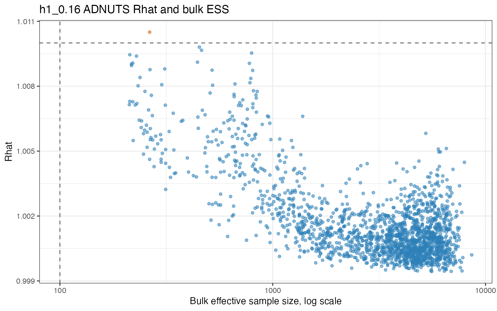{width=80%}

ADnuts Rhat and bulk effective sample size diagnostics for h1_0.16.
:::

### MCMC Trace

::: {#fig-diagnostics-016-h1-adnuts-trace}
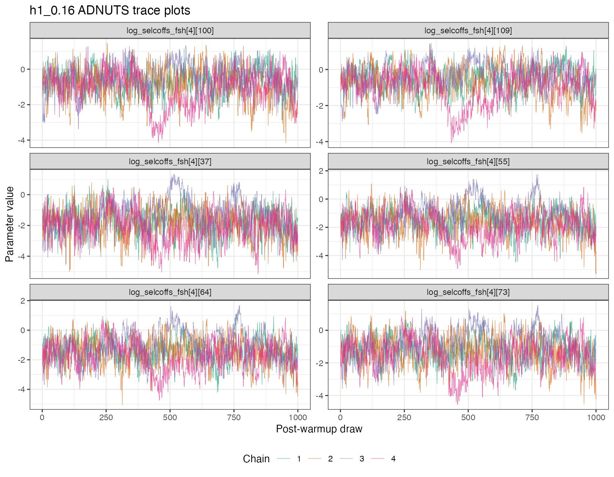{width=90%}

ADnuts trace plots for the slowest-mixing h1_0.16 parameters.
:::

### MCMC Pairs

::: {#fig-diagnostics-016-h1-adnuts-pairs}
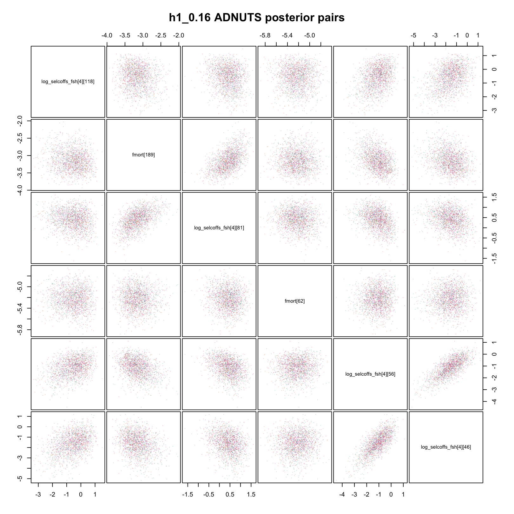{width=90%}

ADnuts posterior pairs plot for the slowest-mixing h1_0.16 parameters.
:::

### MCMC Sampler

::: {#fig-diagnostics-016-h1-adnuts-sampler}
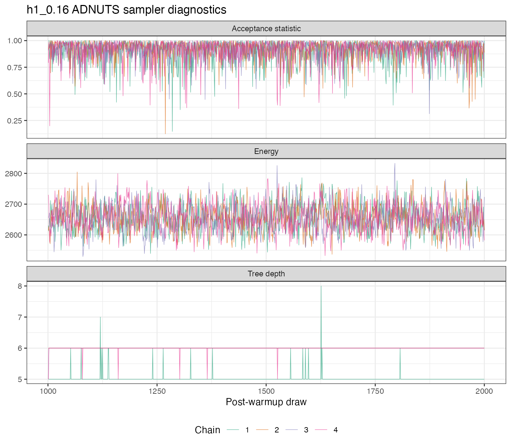{width=80%}

ADnuts sampler diagnostics for h1_0.16.
:::

### ADnuts Uncertainty

::: {#fig-diagnostics-016-h1-adnuts-uncertainties}
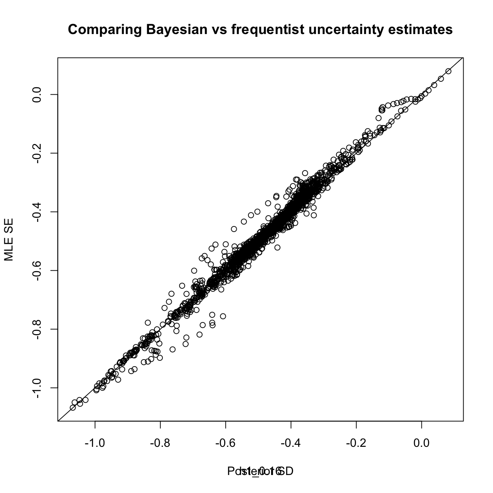{width=75%}

ADnuts comparison of posterior standard deviations and MLE standard errors for h1_0.16.
:::

### ADnuts Slow Pairs

::: {#fig-diagnostics-016-h1-adnuts-pairs-slow-trace}
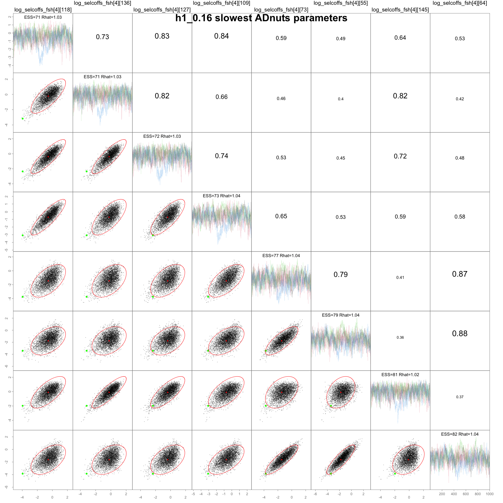{width=90%}

ADnuts `pairs_admb()` plot for the eight slowest-mixing h1_0.16 parameters, with trace plots on the diagonal.
:::

### ADnuts Slow ACF

::: {#fig-diagnostics-016-h1-adnuts-pairs-slow-acf}
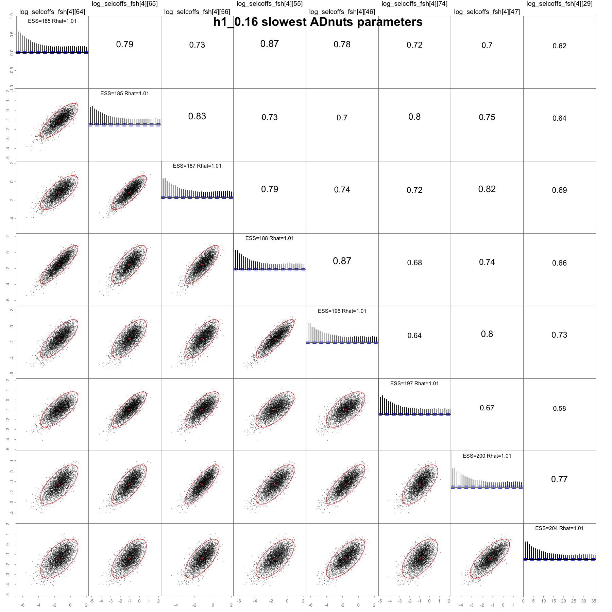{width=90%}

ADnuts `pairs_admb()` plot for the eight slowest-mixing h1_0.16 parameters, with autocorrelation plots on the diagonal.
:::

### ADnuts Slow Marginals

::: {#fig-diagnostics-016-h1-adnuts-marginals-slow}
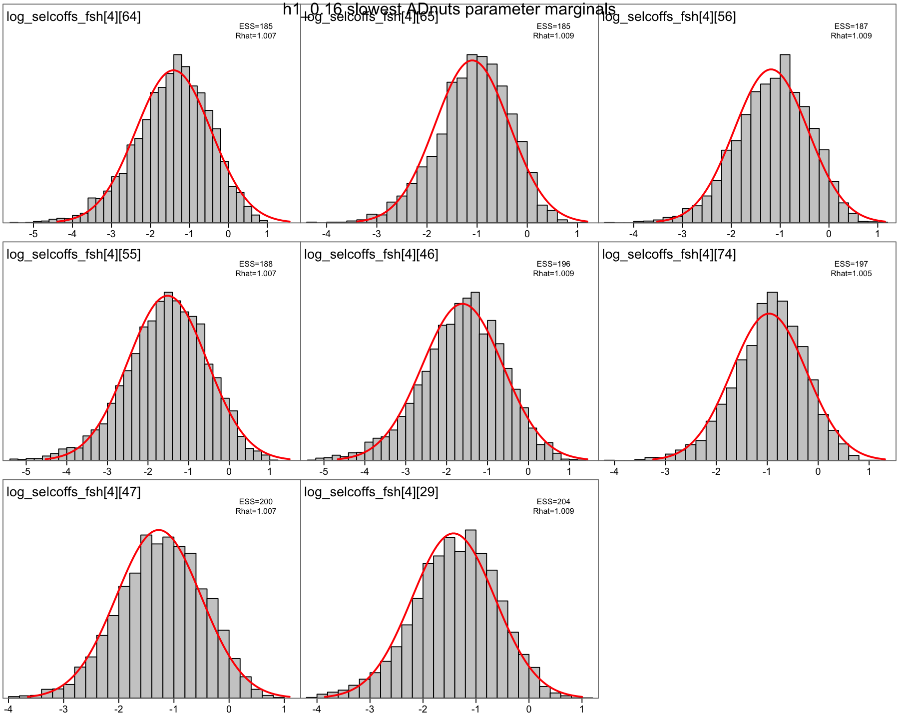{width=85%}

ADnuts marginal posterior distributions for the eight slowest-mixing h1_0.16 parameters.
:::

### ADnuts Sampler Parameters

::: {#fig-diagnostics-016-h1-adnuts-sampler-params}
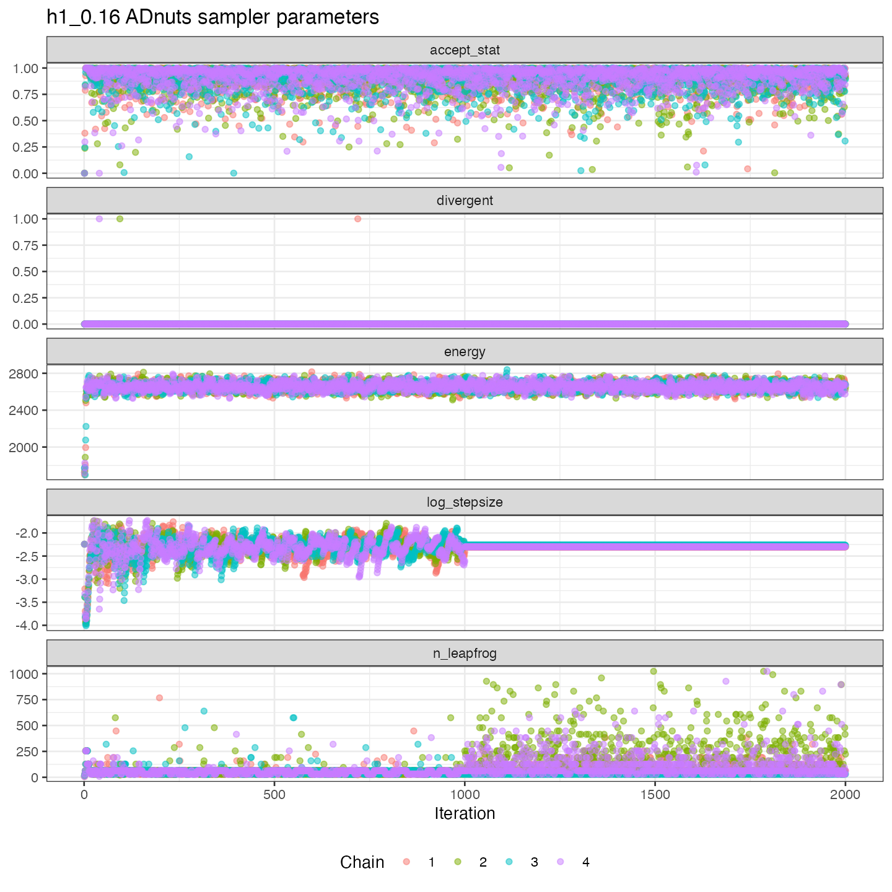{width=80%}

ADnuts NUTS sampler-parameter diagnostics for h1_0.16.
:::

:::

## Two-Stock 0.16

::: {.panel-tabset}

### Index Fits

```{r}
#| label: fig-diagnostics-016-h2-index-fits
#| fig-cap: "Observed and predicted abundance-index values for h2_0.16."
#| fig-width: 8
#| fig-height: 6

plot(h2_diag, var = "predictedObservedIndices")
```

### Index Catchability

```{r}
#| label: fig-diagnostics-016-h2-index-catchability
#| fig-cap: "Index catchability time series for h2_0.16."
#| fig-width: 10
#| fig-height: 7

plot_catchability_diagnostics(h2_diag_model, model_label = h2_diag_nm)
```

### Selectivity

```{r}
#| label: fig-diagnostics-016-h2-fishery-selectivity
#| fig-cap: "Fishery selectivity diagnostics for h2_0.16."
#| fig-width: 10
#| fig-height: 8

selectivity_age_axis(
  plot_selectivities(h2_selectivities, fleet = "fsh", alpha = 0.35, scale = 5)
)
```

```{r}
#| label: fig-diagnostics-016-h2-index-selectivity
#| fig-cap: "Survey/index selectivity diagnostics for h2_0.16."
#| fig-width: 10
#| fig-height: 9

selectivity_age_axis(
  plot_selectivities(h2_selectivities, fleet = "ind", alpha = 0.3, scale = 5)
)
```

### Fishery Age Composition

```{r}
#| label: fig-diagnostics-016-h2-age-fits-catch
#| fig-cap: "Fishery age-composition fits for h2_0.16."
#| fig-width: 10
#| fig-height: 12

h2_age_comp_fits <- diagnostic_comp_data(h2_diag_model, stock = 1, comp_type = "age") %>%
  filter(source_type == "fsh")
h2_age_comp_sources <- h2_age_comp_fits %>%
  distinct(source_id, source_name) %>%
  arrange(source_id) %>%
  pull(source_name)

walk(
  h2_age_comp_sources,
  ~print(plot_agecomp_fit(h2_age_comp_fits, .x, ncol = 4) + labs(subtitle = paste(h2_diag_nm, "south stock")))
)
```

### Age OSA and Aggregate Fits

```{r}
#| label: fig-diagnostics-016-h2-age-osa-aggregate
#| fig-cap: "Non-CPUE OSA residual QQ diagnostics and aggregate age-composition fits for the southern stock in h2_0.16."
#| fig-width: 9
#| fig-height: 8

plot_composition_diagnostics(
  h2_diag_model,
  stock = 1,
  comp_type = "age",
  model_label = paste(h2_diag_nm, "south stock"),
  exclude_source_pattern = "CPUE"
)
```

### Fishery Length Composition

```{r}
#| label: fig-diagnostics-016-h2-length-fits-catch
#| fig-cap: "Fishery length-composition fits for h2_0.16."
#| fig-width: 10
#| fig-height: 14

h2_length_comp_fits <- diagnostic_comp_data(h2_diag_model, stock = 2, comp_type = "length") %>%
  filter(source_type == "fsh")
h2_length_comp_sources <- h2_length_comp_fits %>%
  distinct(source_id, source_name) %>%
  arrange(source_id) %>%
  pull(source_name)

walk(
  h2_length_comp_sources,
  ~print(plot_lengthcomp_fit(h2_length_comp_fits, .x, ncol = 4) + labs(subtitle = paste(h2_diag_nm, "FarNorth stock")))
)
```

### Length OSA and Aggregate Fits

```{r}
#| label: fig-diagnostics-016-h2-length-osa-aggregate
#| fig-cap: "OSA residual QQ diagnostics and aggregate length-composition fits for the FarNorth fishery in h2_0.16."
#| fig-width: 9
#| fig-height: 8

plot_composition_diagnostics(
  h2_diag_model,
  stock = 2,
  comp_type = "length",
  model_label = paste(h2_diag_nm, "FarNorth stock"),
  source_names = c("FarNorth")
)
```

### Retrospective SSB

```{r}
#| label: fig-diagnostics-016-h2-retro-ssb
#| fig-cap: "Retrospective spawning biomass from five peels for h2_0.16."

load(file.path("results", paste0(h2_diag_nm, "_retrospective.RData")))
h2_retro <- output
plot(h2_retro, var = "SSB")
```

### Retrospective Recruitment

```{r}
#| label: fig-diagnostics-016-h2-retro-recruitment
#| fig-cap: "Retrospective recruitment from five peels for h2_0.16."

plot(h2_retro, var = "R")
```

### MCMC Rhat and ESS

::: {#fig-diagnostics-016-h2-adnuts-rhat-ess}
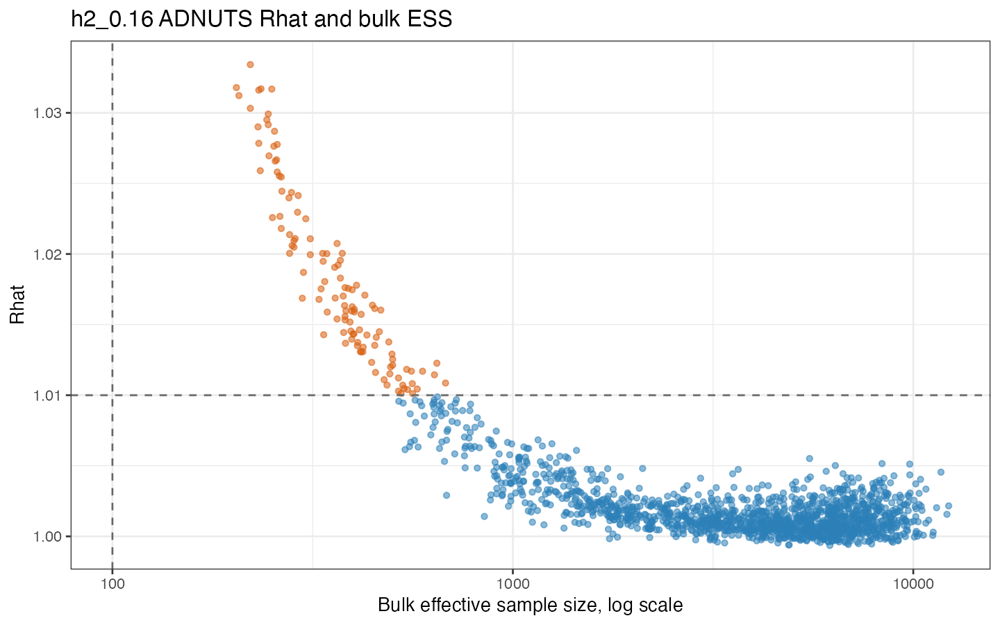{width=80%}

ADnuts Rhat and bulk effective sample size diagnostics for h2_0.16.
:::

### MCMC Trace

::: {#fig-diagnostics-016-h2-adnuts-trace}
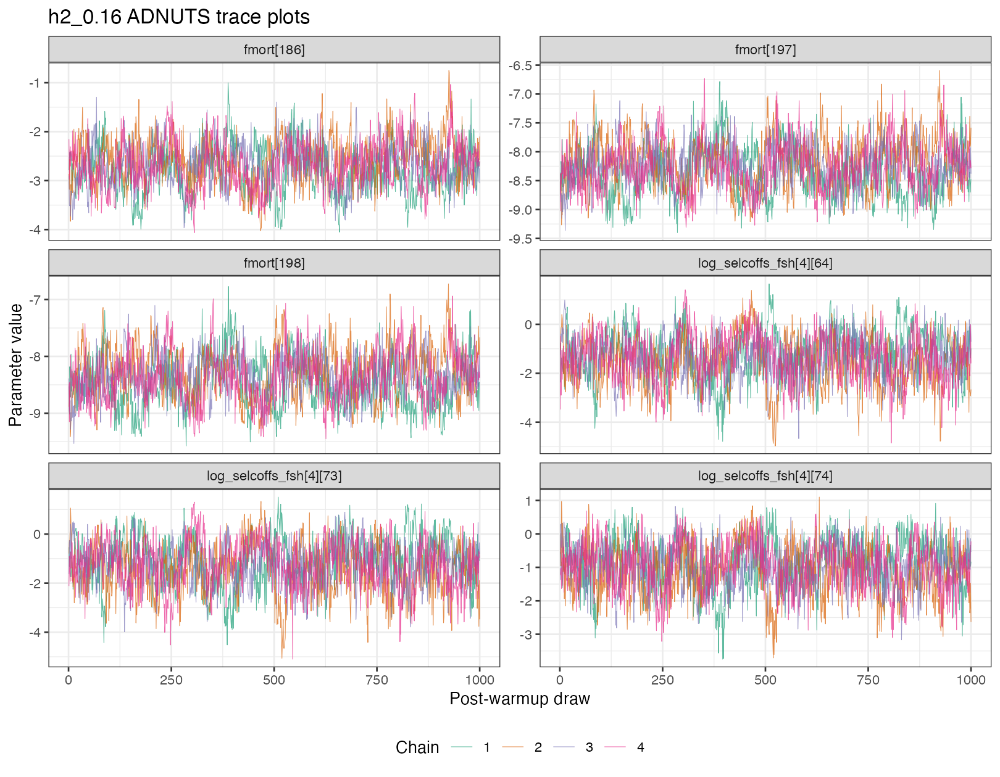{width=90%}

ADnuts trace plots for the slowest-mixing h2_0.16 parameters.
:::

### MCMC Pairs

::: {#fig-diagnostics-016-h2-adnuts-pairs}
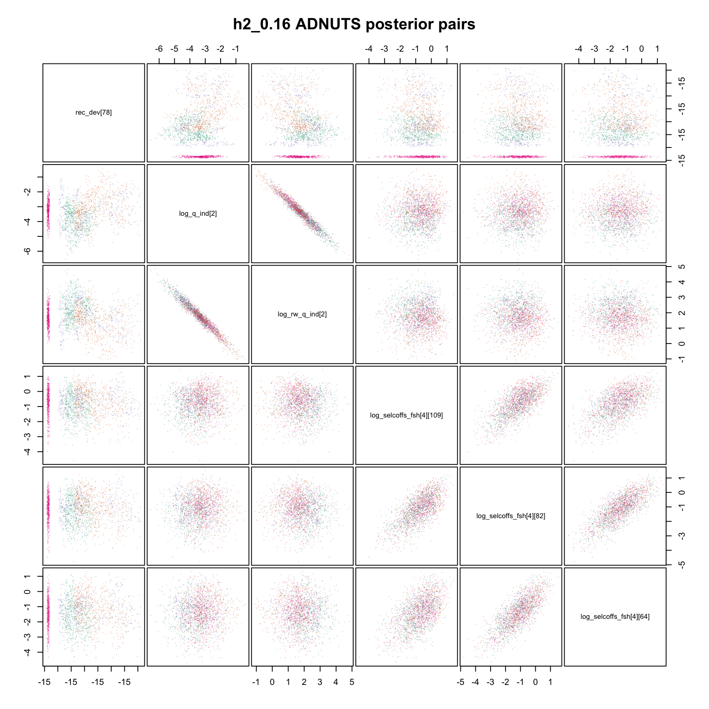{width=90%}

ADnuts posterior pairs plot for the slowest-mixing h2_0.16 parameters.
:::

### MCMC Sampler

::: {#fig-diagnostics-016-h2-adnuts-sampler}
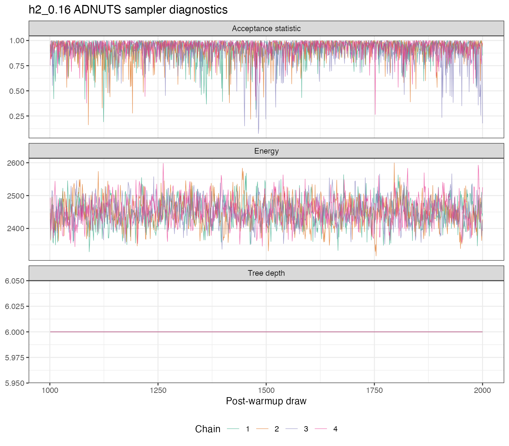{width=80%}

ADnuts sampler diagnostics for h2_0.16.
:::

### ADnuts Uncertainty

::: {#fig-diagnostics-016-h2-adnuts-uncertainties}
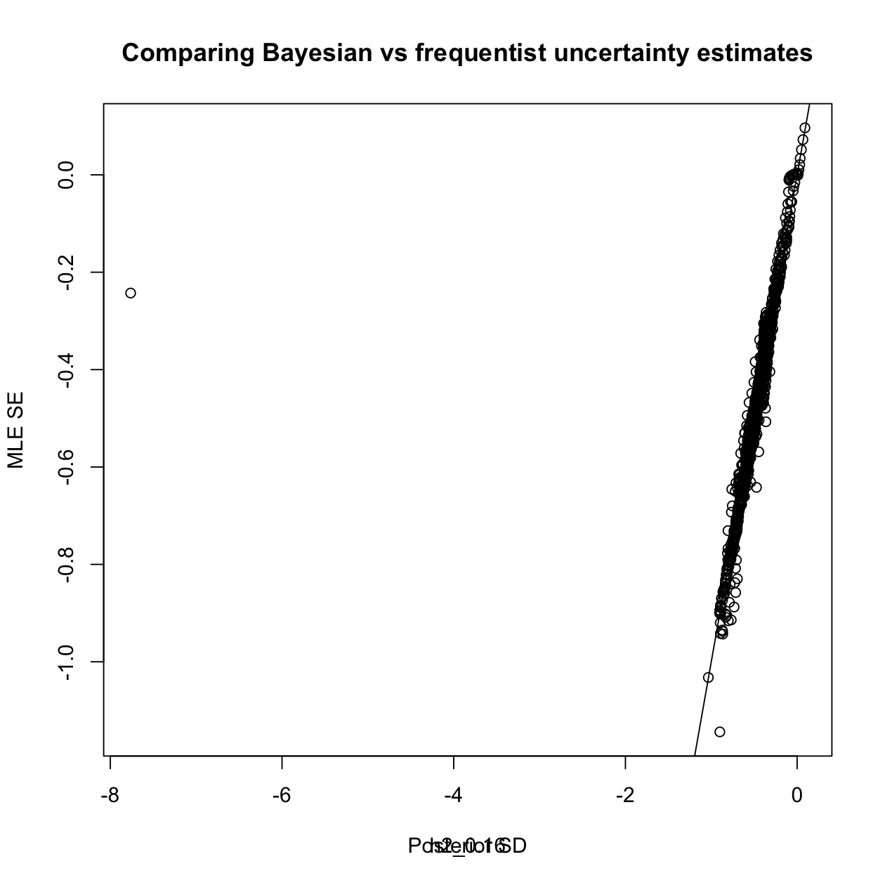{width=75%}

ADnuts comparison of posterior standard deviations and MLE standard errors for h2_0.16.
:::

### ADnuts Slow Pairs

::: {#fig-diagnostics-016-h2-adnuts-pairs-slow-trace}
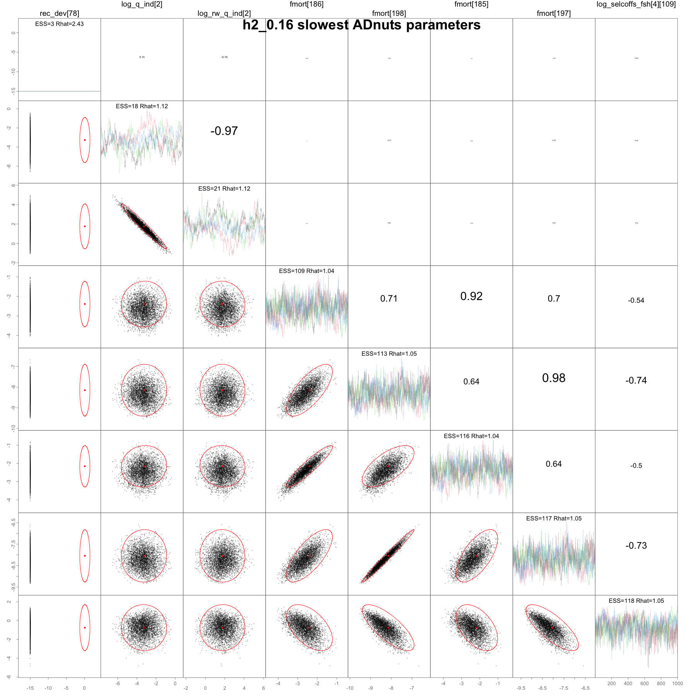{width=90%}

ADnuts `pairs_admb()` plot for the eight slowest-mixing h2_0.16 parameters, with trace plots on the diagonal.
:::

### ADnuts Slow ACF

::: {#fig-diagnostics-016-h2-adnuts-pairs-slow-acf}
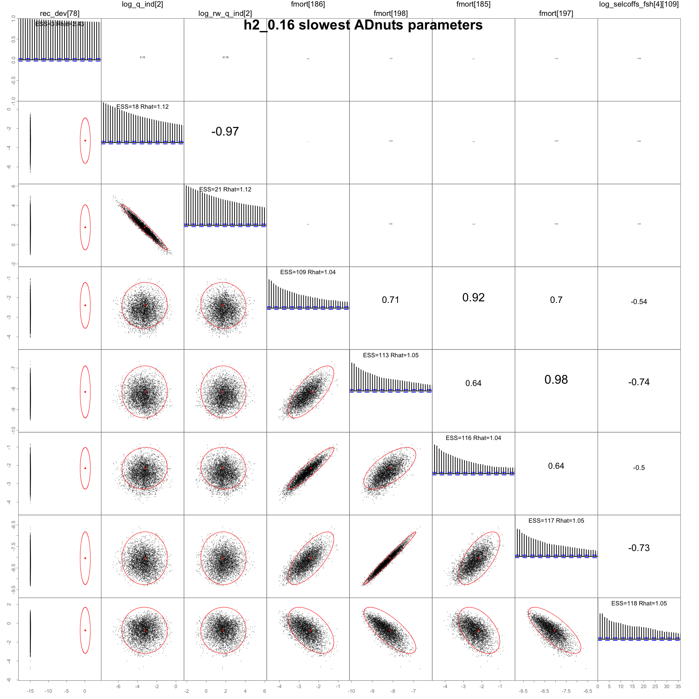{width=90%}

ADnuts `pairs_admb()` plot for the eight slowest-mixing h2_0.16 parameters, with autocorrelation plots on the diagonal.
:::

### ADnuts Slow Marginals

::: {#fig-diagnostics-016-h2-adnuts-marginals-slow}
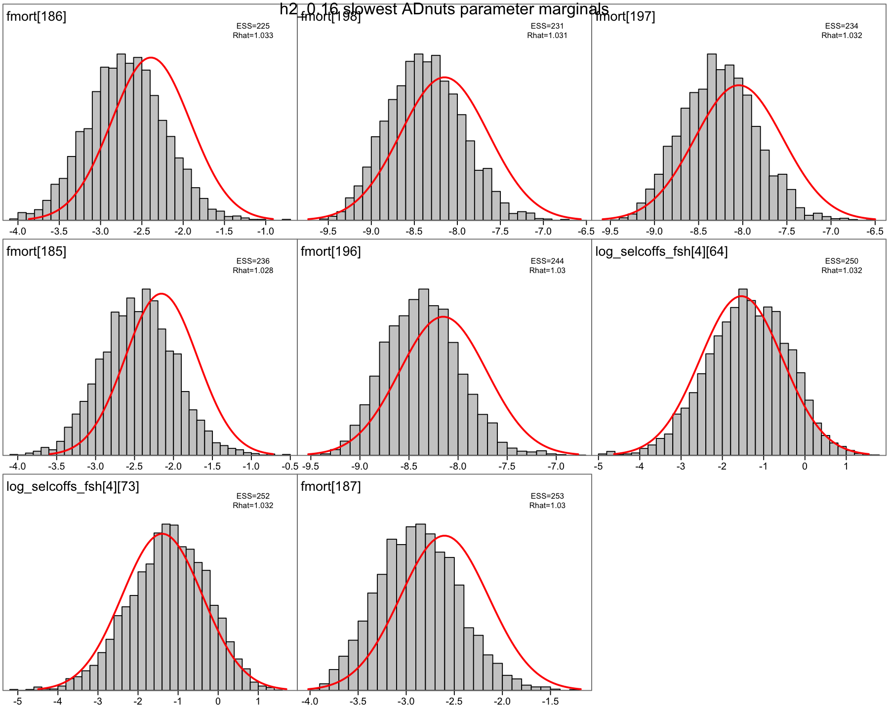{width=85%}

ADnuts marginal posterior distributions for the eight slowest-mixing h2_0.16 parameters.
:::

### ADnuts Sampler Parameters

::: {#fig-diagnostics-016-h2-adnuts-sampler-params}
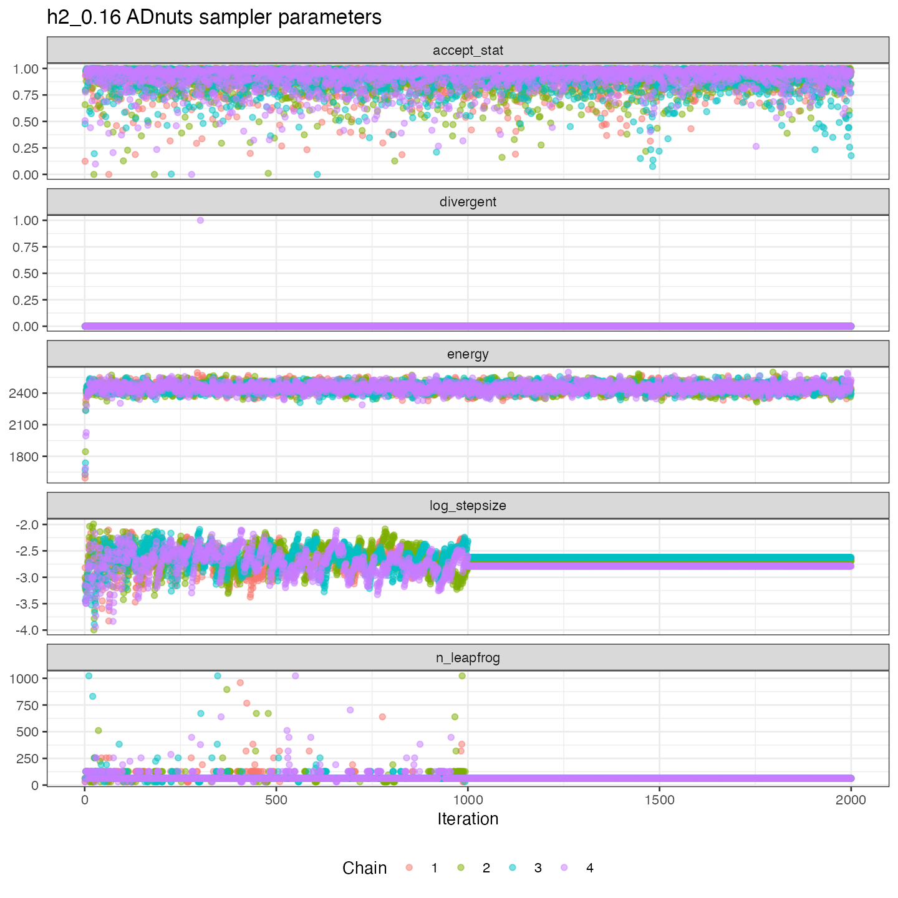{width=80%}

ADnuts NUTS sampler-parameter diagnostics for h2_0.16.
:::

:::

# Notes

## Fishing-mortality cap

The current JJM template includes a smooth penalty on high average fishing mortality. For each stock and model year, total fishing mortality is first summed across fisheries for that stock. The intermediate value `Fbar_tmp` is the mean total F over ages 2-5. With `Fcap = 3`, `eps = 0.05`, and `lambda_F = 10`, the penalty contribution is:

$$
\mathrm{excess} =
{1 \over 2}\left[(Fbar\_tmp - Fcap) +
\sqrt{(Fbar\_tmp - Fcap)^2 + eps^2}\right]
$$

$$
\mathrm{fpen} \mathrel{+}= \lambda_F \times \mathrm{excess}^2
$$

This behaves like a differentiable approximation to `10 * max(0, Fbar_tmp - 3)^2`. It is nearly zero below the cap, mild near `Fbar_tmp = 3`, and increasingly strong when a stock-year Fbar exceeds the cap. The form avoids a hard discontinuity in the objective function and is intended to discourage the unrealistically high terminal fishing-mortality spikes seen in some model-development trials without imposing a non-differentiable bound.

## Output status

At render time, model outputs were available for the core bridge models `r paste(core_completed_versions, collapse = ", ")`.
