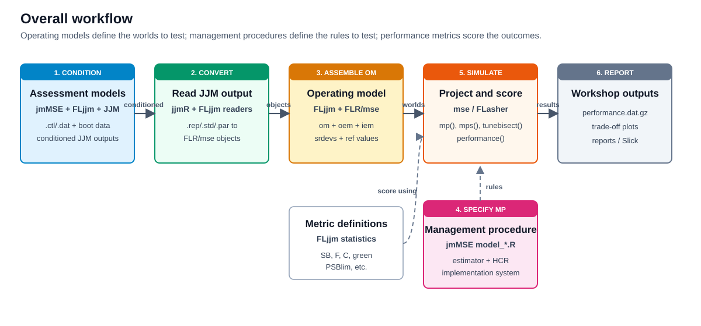



# Purpose

This note is a working map of the software layers used in the jack mackerel management strategy evaluation (MSE) workflow. It is intended to explain how operating models (OMs) are created from JJM assessment configurations, how management procedures (MPs) are specified in `jmMSE`, and how candidate MPs are tested against performance metrics.

The short version is:

1. JJM is the assessment engine.
2. `jjmR` reads and writes JJM input and output files.
3. `FLjjm` runs JJM and converts JJM output into FLR/mse objects.
4. `jmMSE` defines the OM set, candidate MPs, simulations, tuning, diagnostics, and reports.
5. `mse`, `msemodules`, `FLCore`, `FLFishery`, and `FLasher` provide the simulation object classes and MP machinery.

# Package Roles

| Layer | Main responsibility | Typical objects or files |
|---|---|---|
| JJM | Compiled ADMB stock assessment model for Chilean jack mackerel | `jjms`, `.ctl`, `.dat`, `.rep`, `.std`, `.par`, `For_R_*.rep` |
| `jjmR` | Low-level R input/output layer for JJM | `writeJJM()`, `readJJM()`, `jjm.output` |
| `FLjjm` | Adapter between JJM and FLR/mse | `readFLomjjm()`, `readFLSjjm()`, `readFLIsjjm()`, `cjm.oem()`, `cjm.iem()`, `jjms.sa()`, `statistics` |
| FLR/mse stack | Generic MSE classes, projection, and MP execution | `FLStock`, `FLStocks`, `FLIndex`, `FLIndices`, `FLombf`, `FLoem`, `FLiem`, `mpCtrl()`, `mseCtrl()`, `mp()` |
| `jmMSE` | Project-specific workflow and candidate MP testing | `data_condition.R`, `data_load.R`, `model_*.R`, `utilities.R`, reports, tests |

# Overall Flow

{#fig-overall-flow width="100%" fig-alt="Flow diagram showing assessment models conditioned through jmMSE, FLjjm, and JJM; converted by jjmR and FLjjm into FLR and mse objects; assembled as operating models; combined with management procedures; simulated and scored against performance metrics; and reported as workshop outputs."}

# Operating Model Construction

In `jmMSE`, the OM set is currently defined as a table of model configurations in `data_condition.R`. Each row identifies a JJM model, source year, option, robustness or reference status, working directory, and output file name.

```{mermaid}
flowchart LR
  A["boot/initial/data/<year>/<model><br/>JJM .ctl and .dat inputs"] --> B["data_condition.R<br/>models table"]
  B --> C["conditionJJOM() in utilities.R"]
  C --> D["FLjjm::exejjms()<br/>FLjjm::calljjms()"]
  D --> E["jjms ADMB run"]
  E --> F["data/cond_<short>_<model>_<opt>_<set>/"]
  F --> G["adnuts::sample_nuts()<br/>posterior samples"]
  G --> H["mcout_<model>.rds<br/>mceval.rep.gz"]
  F --> I["data_load.R"]
  I --> J["constructJJOM() in utilities.R"]
  J --> K["FLjjm::readFLomjjm()<br/>FLjjm::readFLoemjjm()"]
  K --> L["OM bundle<br/>om + oem + iem + srdevs + unfishedSSB"]
  L --> M["data/<short>_<model>_<opt>.rds"]
```

The important distinction is that JJM defines the assessment-conditioned biological and fishery dynamics, while `FLjjm` converts those results into FLR/mse objects that can be projected under candidate MPs.

Typical OM bundle fields are:

| Field | Meaning |
|---|---|
| `om` | The operating model, usually an `FLombf` object containing biology, fisheries, reference points, and projection method. |
| `oem` | The observation error model, usually a `FLoem` object with simulated index observations. |
| `iem` | The implementation error model, usually an `FLiem` object controlling how TAC or catch advice is implemented across fisheries. |
| `srdevs` | Recruitment-deviation scenarios derived from historical OM recruitment deviances. |
| `unfishedSSB` | Reference unfished biomass metric generated for comparison or derived performance metrics. |

# Management Procedure Specification

Candidate MPs are specified through `mse::mpCtrl()` as three linked modules:

| MP component | Role | Examples in `jmMSE` |
|---|---|---|
| `est` | Estimator or assessment module used inside the MP | `shortcut.sa`, `cpue.ind`, `spict.sa`, `perfect.sa`, `jjms.sa` |
| `hcr` | Harvest control rule that turns estimated status into advice | `buffer.hcr`, `hockeystick.hcr`, `fixedC.hcr` |
| `isys` | Implementation system that distributes advice into fisheries or stocks | `split.is`, usually with `catch_props(om)$last5` |

Typical structure:

```r
ctrl <- mpCtrl(
  est = mseCtrl(
    method = shortcut.sa,
    args = list(metric = "depletion", devs = metdevs, B0 = refpts(om)$SB0)
  ),
  hcr = mseCtrl(
    method = hockeystick.hcr,
    args = list(
      lim = 0.10, trigger = 0.40, metric = "depletion",
      target = mean(refpts(om)$MSY), output = "catch"
    )
  ),
  isys = mseCtrl(
    method = split.is,
    args = list(split = catch_props(om)$last5)
  )
)
```

Then the MP is run against an OM:

```r
run <- mp(
  om,
  oem = oem,
  iem = iem,
  ctrl = ctrl,
  args = list(iy = 2025, fy = 2050)
)
```

# Testing Against Performance Metrics

Performance metrics are mostly evaluated through `mse::performance()`, using the `statistics` dataset loaded from `FLjjm` in `config.R`.

```{mermaid}
flowchart TD
  OM["Operating model<br/>om + oem + iem"] --> MP["Candidate MP<br/>est + hcr + isys"]
  MP --> SIM["mp(), mps(), or tunebisect()<br/>future projections by iteration"]
  SIM --> TRACK["simulation output and tracking<br/>stock, catch, decisions, estimates"]
  STATS["FLjjm statistics<br/>C, F, SB, SBMSY, green, PSBlim, etc."] --> PERF["performance()"]
  TRACK --> PERF
  PERF --> TABLE["performance table<br/>statistic x year x MP x OM"]
  TABLE --> TUNE["tuning decisions<br/>e.g., target giving P(green) = 0.6"]
  TABLE --> REPORT["trade-off plots<br/>tables, reports, Slick app"]
```

Common calls in the local workflow are:

```r
performance(run, statistics = statistics["green"], years = ty)

tuned <- tunebisect(
  om,
  oem = oem,
  iem = iem,
  control = ctrl,
  statistic = statistics["green"],
  years = ty,
  prob = 0.6
)

runs <- FLmses(list(tune06 = tuned), statistics = statistics)
```

# Local Code Map

| Purpose | Local file |
|---|---|
| Load core packages and `FLjjm` statistics | `jmMSE/config.R` |
| Define the conditioned JJM model grid | `jmMSE/data_condition.R` |
| Run JJM and ADNUTS for conditioned OMs | `jmMSE/utilities.R`, `conditionJJOM()` |
| Convert conditioned JJM runs into OM bundles | `jmMSE/data_load.R`, `constructJJOM()` |
| Read FLR objects from JJM output | `FLjjm/R/read.R` |
| Execute bundled `jjms` model | `FLjjm/R/run.R` |
| CJM-specific OEM/IEM and JJM assessment modules | `FLjjm/R/mse.R` |
| Shortcut MP examples | `jmMSE/model_shortcut.R` |
| Fixed-catch MP examples | `jmMSE/model_fixed.R` |
| SPiCT MP examples and helper functions | `jmMSE/model_spict.R`, `jmMSE/utilities.R` |
| Tests and diagnostics | `jmMSE/tests/` |

# Mental Model

The workflow is easiest to read as a data transformation:

```{mermaid}
flowchart LR
  A["Assessment inputs<br/>JJM .ctl/.dat"] --> B["Conditioned JJM run"]
  B --> C["FLjjm conversion"]
  C --> D["MSE operating model"]
  D --> E["Candidate MP"]
  E --> F["Future simulation"]
  F --> G["Performance metrics"]
  G --> H["Trade-off and robustness decisions"]
```

The OM describes the world being tested. The MP describes the rule being tested. The performance metrics describe how that rule behaves across simulated futures and robustness scenarios.
