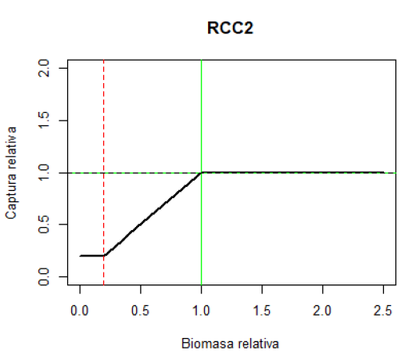
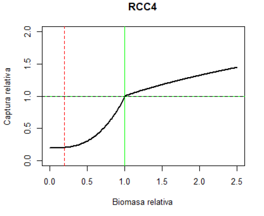



```{=html}
<div class="paper-title">SCW17/paper-05 Chile HCR proposals</div>
```

# Document Status and Traceability

This page is an SCW17 Quarto conversion of the Word document supplied by the Chilean delegation.
The content below preserves the supplied text and embedded figures, with only formatting changes needed to publish it in the SCW17 website structure.

| Item | Description |
|---|---|
| SCW17 identifier | `SCW17/paper-05` |
| SCW17 source file | `doc/SCW17-Paper-05-Chile-HCR-Proposals.qmd` |
| Original Word document | [HCR_Chile_08-06-26.docx](assets/HCR_Chile_08-06-26.docx) |
| Supplied Word filename | `HCR_Chile (08-06-26).docx` |
| Conversion note | Embedded figures were extracted from the Word document and retained as PNG images. |
| SCW17 role | Chilean delegation contribution describing proposed harvest control rules for review and testing. |

No benchmark results, operating-model assumptions, management-procedure definitions, performance metric definitions, or reference points were changed by this conversion.

# Harvest Control Rules Proposed by the Chilean Delegation

Based on the results of the FIPA 2024-27 project, "Design and Implementation of Management Strategies Using the OpenMSE Platform in the Jack Mackerel Fishery", the Chilean delegation is interested in testing the following Harvest Control Rules (HCRs), which were developed jointly with stakeholders from the jack mackerel fishery, particularly the Jack Mackerel Management Committee.

# Model-Based Harvest Control Rules

Two HCRs were considered, both expressed as functions of relative biomass and relative catch, as described below:

## HCR2: Ramp-Type Rule

HCR2 is a ramp-type rule (Figure 1) with a catch stability constraint of +20%/-15% (increase/decrease), a minimum catch of 270,000 tonnes, and a target catch level (TACref) of 1,500,000 tonnes.

{width="60%" fig-alt="Graphical representation of the ramp-type harvest control rule. The green line indicates the target biomass and the red line indicates the biomass limit threshold."}

{width="100%" fig-alt="Screenshot of R code used for implementing the ramp-type harvest control rule."}

## HCR4: Double-Potential Rule

HCR4 is a double-potential rule (Figure 2) with a catch stability constraint of +20%/-15% (increase/decrease), a minimum catch of 270,000 tonnes, and a target catch level (TACref) of 1,500,000 tonnes.

{width="60%" fig-alt="Graphical representation of the double-potential harvest control rule. The green line indicates the target biomass and the red line indicates the biomass limit threshold."}

{width="100%" fig-alt="Screenshot of R code used for implementing the double-potential harvest control rule."}

# Empirical Harvest Control Rules

Two empirical HCRs were considered, based on the relationship between spawning biomass estimated by the Joint Jack Mackerel Model (JJM) and the acoustic abundance index obtained from the hydroacoustic survey conducted in Northern Chile (Arica and Parinacota, Tarapacá, and Antofagasta Regions) (Figure 5):

## HCR2: Ramp-Type Rule

HCR2 is a ramp-type rule (Figure 3) with two alternative reference catch levels (Cref) of 1.5 and 2.0 million tonnes, and a minimum catch of 270,000 tonnes.

{width="65%" fig-alt="Relationship between biological acceptable catch and the Northern Chile acoustic survey abundance index under a ramp-type harvest control rule for two reference catch levels."}

## HCR4: Double-Potential Rule

HCR4 is a double-potential rule (Figure 4) with two alternative reference catch levels (Cref) of 1.5 and 2.0 million tonnes, and a minimum catch of 270,000 tonnes.

{width="65%" fig-alt="Relationship between biological acceptable catch and the Northern Chile acoustic survey abundance index under a double-potential harvest control rule for two reference catch levels."}

{width="65%" fig-alt="Relationship between spawning biomass estimated by JJM and biomass estimated from the Northern Chile acoustic survey from 2000 to 2024."}
