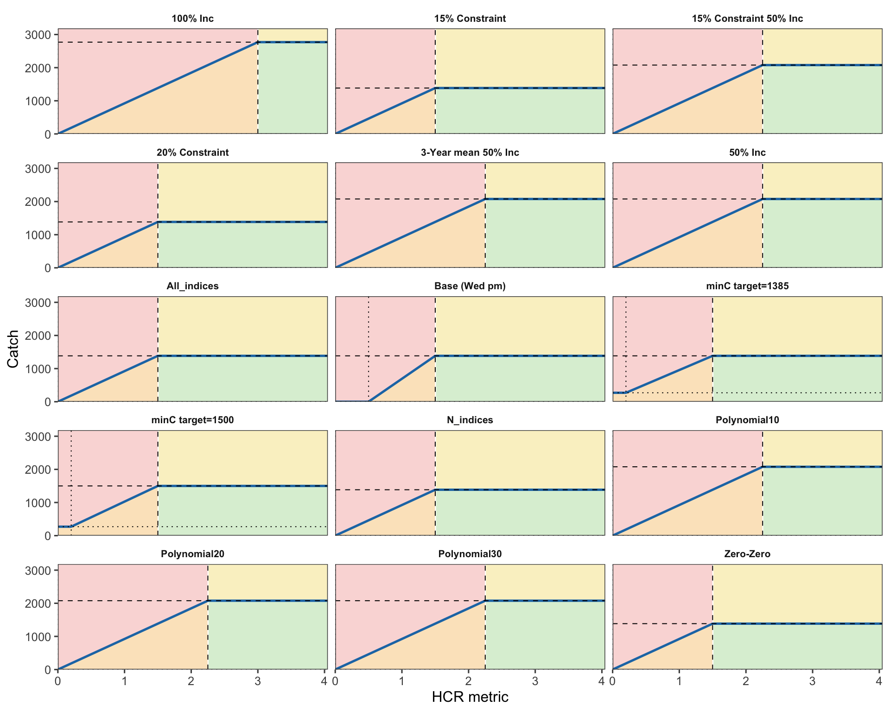



```{=html}
<div class="paper-title">SCW17/Paper-09: CMP test instructions</div>
```

# Purpose

This note gives step-by-step instructions for implementing the candidate management procedure (CMP) tests shown in @fig-cmp-hcr-panels and listed in @tbl-cmp-tests.
The tests are intended for the `jmMSE` repository and are based on the current index-based hockeystick CMP development in `model_indices.R`.

The document is instructional.
It does not change any operating model, reference point, performance metric, or management procedure definition.
Rows marked as unavailable should not be presented as completed tests until the stated implementation issue has been resolved.

{#fig-cmp-hcr-panels width="100%" fig-alt="A multi-panel figure showing candidate hockeystick harvest control rule shapes for candidate management procedures. Each panel plots catch against HCR metric for named CMPs including 100% increase, 15 percent constraint, 20 percent constraint, 50 percent increase, all indices, base, minimum catch variants, northern indices, polynomial smoothing variants, and zero-zero."}

# Required R Environment

Run these tests from the root of the `jmMSE` repository.
The normal setup route is to source `config.R`, because it loads the FLR, MSE, and local helper dependencies and sources `utilities.R`.

```{r}
# From /path/to/jmMSE
cores <- 3
source("config.R")
```

The current implementation requires the following R packages directly or through `config.R`:

| Package | Main use in this workflow |
|---|---|
| `TAF` | Directory creation and workflow conventions |
| `mse` | `mpCtrl()`, `mseCtrl()`, `mp()`, `mps()`, performance machinery |
| `msemodules` | Standard estimator, HCR, and implementation modules |
| `FLasher` | Forward projection machinery |
| `FLjjm` | Jack mackerel OM/OEM objects and performance statistics |
| `FLCore` | FLR data structures used by the OM and index objects |
| `data.table` | Tabular setup and summarisation |
| `ggplot2` | HCR and diagnostic plotting |
| `future`, `future.apply`, `doFuture` | Parallel execution |

Optional packages are needed only for exploratory diagnostics and smoothing screens:

| Package | Use |
|---|---|
| `mgcv` | Smooth response-surface diagnostics for parameter screens |
| `akima` | Interpolation for contour diagnostics |
| `lhs` | Latin-hypercube parameter screens |

# Data and Object Prerequisites

Before running CMP tests, confirm that the conditioned OM files exist and can be loaded.
For the current one-stock example, the required file is:

```{r}
file.exists("data/om11_h1_0.16_065.rds")
```

The standard loading block is:

```{r}
cores <- 3
source("config.R")

mkdir("model/indices")

om11 <- readRDS("data/om11_h1_0.16_065.rds")
spread(om11, FORCE = TRUE)

iy <- 2025
fy <- 2050
ty <- seq(iy + 11, iy + 15)
rys <- ac(seq(2019, 2023))

cprop <- catch_props(om)$last5
```

After `spread(om11, FORCE = TRUE)`, the object components used below are available in the global session as `om`, `oem`, and `iem`.

# CMP Test Table

| CMP name | min | lim | trigger | target | dlow | dupp | smooth | indices | output | status |
|---|---:|---:|---:|---:|---:|---:|---|---|---|---|
| Base (Wed pm) | 0 | 0.5 | 1.50 | 1385.0 | unconstrained | unconstrained | 4 years | `Chile_CPUE`, `Offshore_CPUE` | catch | available |
| Zero-Zero | 0 | 0.0 | 1.50 | 1385.0 | unconstrained | unconstrained | 4 years | `Chile_CPUE`, `Offshore_CPUE` | catch | available |
| 15% Constraint | 0 | 0.0 | 1.50 | 1385.0 | 0.85 | 1.20 | 4 years | `Chile_CPUE`, `Offshore_CPUE` | catch | available |
| 20% Constraint | 0 | 0.0 | 1.50 | 1385.0 | 0.80 | 1.20 | 4 years | `Chile_CPUE`, `Offshore_CPUE` | catch | available |
| 50% Inc | 0 | 0.0 | 2.25 | 2077.5 | unconstrained | unconstrained | 4 years | `Chile_CPUE`, `Offshore_CPUE` | catch | available |
| 15% Constraint 50% Inc | 0 | 0.0 | 2.25 | 2077.5 | 0.85 | 1.20 | 4 years | `Chile_CPUE`, `Offshore_CPUE` | catch | available |
| 3-Year mean 50% Inc | 0 | 0.0 | 2.25 | 2077.5 | 0.85 | 1.20 | 3 years | `Chile_CPUE`, `Offshore_CPUE` | catch | available |
| Polynomial10 | 0 | 0.0 | 2.25 | 2077.5 | 0.85 | 1.20 | poly (enp = 0.1) | `Chile_CPUE`, `Offshore_CPUE` | catch | not available as polynomial today |
| Polynomial20 | 0 | 0.0 | 2.25 | 2077.5 | 0.85 | 1.20 | poly (enp = 0.2) | `Chile_CPUE`, `Offshore_CPUE` | catch | not available as polynomial today |
| Polynomial30 | 0 | 0.0 | 2.25 | 2077.5 | 0.85 | 1.20 | poly (enp = 0.3) | `Chile_CPUE`, `Offshore_CPUE` | catch | not available as polynomial today |
| 100% Inc | 0 | 0.0 | 3.00 | 2770.0 | 0.85 | 1.20 | 4 years | `Chile_CPUE`, `Offshore_CPUE` | catch | available |
| minC target=1385 | 270 | 0.2 | 1.50 | 1385.0 | 0.85 | 1.20 | 4 years | `Chile_CPUE`, `Offshore_CPUE` | catch | available |
| minC target=1500 | 270 | 0.2 | 1.50 | 1500.0 | 0.85 | 1.20 | 4 years | `Chile_CPUE`, `Offshore_CPUE` | catch | available |
| All_indices | 0 | 0.0 | 1.50 | 1385.0 | 0.85 | 1.20 | 4 years | `Chile_CPUE`, `Offshore_CPUE`, `Chile_AcousN`, `Peru_Artis` | catch | available after index-name check |
| N_indices | 0 | 0.0 | 1.50 | 1385.0 | 0.85 | 1.20 | 4 years | `Chile_AcousN`, `Peru_Artis` | catch | available after index-name check |

: Candidate CMP tests requested for the index-based hockeystick test set. {#tbl-cmp-tests}

The table uses current `jmMSE` index names where these differ from the shortened workshop labels:

- `C_CPUE` means `Chile_CPUE`.
- `offshore` means `Offshore_CPUE`.
- `Acoustic_N` means `Chile_AcousN`.
- `Peru_Art` means `Peru_Artis`.

# Availability Notes

The immediately available tests are the hockeystick tests that use `combine = "mean"` in `cpues.ind()` and pass HCR arguments to `hockeystick.hcr()`.
These include the base, zero-zero, 15% constraint, 20% constraint, 50% increase, 100% increase, minimum-catch, and three-year mean rows.

The rows labelled `Polynomial10`, `Polynomial20`, and `Polynomial30` are not available as polynomial tests today.
The current `jmMSE` code has a `combine = "smooth"` option in `cpues.ind()`, implemented through `smooth_index()` and a loess effective-parameter multiplier (`enp.mult`), not a polynomial smoother.
These rows can be run today as loess-smoothed index sensitivity tests with `enp.mult = 0.1`, `0.2`, and `0.3`, but they should not be labelled as polynomial CMPs unless a polynomial estimator is added.

The `All_indices` and `N_indices` rows should be checked against the exact index names present in the selected OM/OEM before running.
Use:

```{r}
names(observations(oem)$CJM$idx)
```

If an index name is absent, stop and document the mismatch rather than silently substituting another index.

# Step-by-Step Implementation

## Step 1: Define the CMP table in R

Use one table as the source of truth for the rows to run.
This avoids hand-editing individual control blocks.

```{r}
cmp_specs <- data.table::data.table(
  cmp = c(
    "Base (Wed pm)",
    "Zero-Zero",
    "15% Constraint",
    "20% Constraint",
    "50% Inc",
    "15% Constraint 50% Inc",
    "3-Year mean 50% Inc",
    "100% Inc",
    "minC target=1385",
    "minC target=1500",
    "All_indices",
    "N_indices"
  ),
  min = c(0, 0, 0, 0, 0, 0, 0, 0, 270, 270, 0, 0),
  lim = c(0.5, 0, 0, 0, 0, 0, 0, 0, 0.2, 0.2, 0, 0),
  trigger = c(1.5, 1.5, 1.5, 1.5, 2.25, 2.25, 2.25, 3.0, 1.5, 1.5, 1.5, 1.5),
  target = c(1385, 1385, 1385, 1385, 2077.5, 2077.5, 2077.5, 2770, 1385, 1500, 1385, 1385),
  dlow = c(NA, NA, 0.85, 0.80, NA, 0.85, 0.85, 0.85, 0.85, 0.85, 0.85, 0.85),
  dupp = c(NA, NA, 1.20, 1.20, NA, 1.20, 1.20, 1.20, 1.20, 1.20, 1.20, 1.20),
  nyears = c(4, 4, 4, 4, 4, 4, 3, 4, 4, 4, 4, 4),
  combine = "mean",
  indices = list(
    c("Chile_CPUE", "Offshore_CPUE"),
    c("Chile_CPUE", "Offshore_CPUE"),
    c("Chile_CPUE", "Offshore_CPUE"),
    c("Chile_CPUE", "Offshore_CPUE"),
    c("Chile_CPUE", "Offshore_CPUE"),
    c("Chile_CPUE", "Offshore_CPUE"),
    c("Chile_CPUE", "Offshore_CPUE"),
    c("Chile_CPUE", "Offshore_CPUE"),
    c("Chile_CPUE", "Offshore_CPUE"),
    c("Chile_CPUE", "Offshore_CPUE"),
    c("Chile_CPUE", "Offshore_CPUE", "Chile_AcousN", "Peru_Artis"),
    c("Chile_AcousN", "Peru_Artis")
  )
)
```

## Step 2: Add the smoothed sensitivity rows separately

These rows are available only as loess-smoothed sensitivity tests unless a polynomial smoother is implemented.

```{r}
smooth_specs <- data.table::data.table(
  cmp = c("Polynomial10_as_loess", "Polynomial20_as_loess", "Polynomial30_as_loess"),
  min = 0,
  lim = 0,
  trigger = 2.25,
  target = 2077.5,
  dlow = 0.85,
  dupp = 1.20,
  nyears = 4,
  combine = "smooth",
  enp.mult = c(0.1, 0.2, 0.3),
  indices = list(
    c("Chile_CPUE", "Offshore_CPUE"),
    c("Chile_CPUE", "Offshore_CPUE"),
    c("Chile_CPUE", "Offshore_CPUE")
  )
)
```

## Step 3: Check index availability

Stop if requested indices are not available in the current OEM.

```{r}
available_indices <- names(observations(oem)$CJM$idx)

check_indices <- function(indices) {
  missing <- setdiff(indices, available_indices)
  if(length(missing) > 0) {
    stop("Missing requested indices: ", paste(missing, collapse = ", "))
  }
  invisible(TRUE)
}

invisible(lapply(cmp_specs$indices, check_indices))
```

## Step 4: Build a single CMP control object

This helper converts one CMP table row into an `mpCtrl()` object.
It is the safest way to keep the table and implementation synchronized.

```{r}
make_cmp_ctrl <- function(spec, om, rys) {
  hcr_args <- list(
    metric = "mean",
    output = "catch",
    target = spec$target,
    min = spec$min,
    lim = spec$lim,
    trigger = spec$trigger,
    initial = 1385
  )

  if(!is.na(spec$dlow)) hcr_args$dlow <- spec$dlow
  if(!is.na(spec$dupp)) hcr_args$dupp <- spec$dupp

  est_args <- list(
    refyrs = rys,
    combine = spec$combine,
    nyears = spec$nyears,
    indices = spec$indices[[1]]
  )

  if("enp.mult" %in% names(spec)) {
    est_args$enp.mult <- spec$enp.mult
  }

  mpCtrl(
    est = mseCtrl(method = cpues.ind, args = est_args),
    hcr = mseCtrl(method = hockeystick.hcr, args = hcr_args),
    isys = mseCtrl(method = split.is, args = list(split = catch_props(om)$last5))
  )
}
```

## Step 5: Run one example CMP

The 15% constraint row is a useful example because it exercises the normal two-index estimator, the hockeystick HCR, and the interannual catch-change constraints.

```{r}
example_spec <- cmp_specs[cmp == "15% Constraint"]
example_ctrl <- make_cmp_ctrl(example_spec, om = om, rys = rys)

example_run <- mp(
  om,
  oem = oem,
  iem = iem,
  control = example_ctrl,
  args = list(iy = iy, fy = fy)
)

performance(example_run) <- performance(example_run, statistics = statistics)

performance(example_run)[statistic == "green" & year %in% ty,
  .(green = mean(data)), by = year]
```

Inspect the HCR decisions and plotted trajectory before launching all rows:

```{r}
plot_hockeystick.hcr(example_ctrl$hcr)
plot(om, example_run)
inspect(tracking(example_run), "*hcr")
```

## Step 6: Run all immediately available CMP rows

Parallel execution is appropriate once the single-row example has completed.
Use no more workers than available physical cores, and reduce `workers` if memory pressure is observed.

```{r}
library(future.apply)

workers <- min(6L, future::availableCores())
plan(multisession, workers = workers)

cmp_runs <- future_lapply(seq_len(nrow(cmp_specs)), function(i) {
  spec <- cmp_specs[i]
  ctrl <- make_cmp_ctrl(spec, om = om, rys = rys)
  out <- mp(
    om,
    oem = oem,
    iem = iem,
    control = ctrl,
    args = list(iy = iy, fy = fy)
  )
  performance(out) <- performance(out, statistics = statistics)
  out
})

names(cmp_runs) <- cmp_specs$cmp

save(cmp_specs, cmp_runs, file = "model/indices/cmp_tests_paper09.rda",
  compress = "xz")
```

On Linux or macOS, `plan(multicore, workers = workers)` may be faster.
Use `multisession` if forked processing is unstable or if running on Windows.

## Step 7: Summarise tuning-period performance

Use the same tuning years across rows.
The current working convention is `2036:2040`, defined as `iy + 11` through `iy + 15`.

```{r}
cmp_perf <- performance(cmp_runs, statistics = statistics)

cmp_summary <- periodsPerformance(cmp_perf, list(tuning = ty))

plotBPs(cmp_summary, statistics = c("C", "green", "IACC", "SB"))
plotTOs(cmp_summary, x = "C", y = c("green", "IACC", "SB"))

green_summary <- cmp_perf[statistic == "green" & year %in% ty,
  .(green = mean(data)), by = .(run, year)]

green_period <- green_summary[, .(green = mean(green)), by = run][order(-green)]
green_period
```

## Step 8: Run smoothed sensitivity rows only if labelled correctly

Do not report these as polynomial tests unless a polynomial estimator is implemented.
For now, the following runs are loess-smoothed index sensitivity tests.

```{r}
smooth_runs <- future_lapply(seq_len(nrow(smooth_specs)), function(i) {
  spec <- smooth_specs[i]
  check_indices(spec$indices[[1]])
  ctrl <- make_cmp_ctrl(spec, om = om, rys = rys)
  out <- mp(
    om,
    oem = oem,
    iem = iem,
    control = ctrl,
    args = list(iy = iy, fy = fy)
  )
  performance(out) <- performance(out, statistics = statistics)
  out
})

names(smooth_runs) <- smooth_specs$cmp

save(smooth_specs, smooth_runs,
  file = "model/indices/cmp_smooth_sensitivity_paper09.rda",
  compress = "xz")
```

# Approximate Run Time

Run time depends mostly on the number of OM iterations, projection years, number of stocks, and number of workers.
The following planning values are intended for workshop scheduling rather than benchmarking:

| Task | Expected time |
|---|---|
| Load OM and source `config.R` | Less than 1 minute if packages are installed |
| One CMP row with about 100 iterations | A few minutes |
| One CMP row with about 1,000 iterations | Often 10--30 minutes, depending on machine and OM complexity |
| 12 immediately available rows at 100 iterations with 4--6 workers | Roughly 15--45 minutes |
| 12 rows at full iteration count | Potentially several hours |
| Smooth-index sensitivity rows | Similar to standard rows, with additional estimator overhead |

For same-day workshop testing, first run the example CMP with a reduced iteration subset.
Then run all available rows with the same reduced subset to detect coding errors and obvious performance differences.
Only after the reduced run is stable should the full iteration set be launched.

# Quality-Control Checklist

Before presenting results, check:

1. The requested indices are present in the selected OEM.
2. The reported CMP labels match the actual estimator and HCR arguments used.
3. The polynomial rows are either renamed as loess-smoothed sensitivity rows or held back.
4. The tuning years are consistent across all rows.
5. `green`, `C`, `IACC`, and `SB` are computed from the same saved run object.
6. The saved `.rda` output contains both the CMP table and run object, so each result is traceable to the row that produced it.
7. Figures in the workshop report cite the source file, date, OM, iteration count, and whether results are reduced-iteration or full-iteration runs.

# Recommended Same-Day Test Order

1. Run `Zero-Zero` as the basic unconstrained hockeystick control.
2. Run `15% Constraint` and `20% Constraint` to verify interannual catch-change caps.
3. Run `50% Inc` and `15% Constraint 50% Inc` to evaluate the higher target/trigger pair.
4. Run `minC target=1385` to verify the minimum-catch floor.
5. Run `All_indices` and `N_indices` only after index-name checks pass.
6. Hold `Polynomial10`, `Polynomial20`, and `Polynomial30` unless they are explicitly relabelled as loess-smoothed sensitivity tests.
